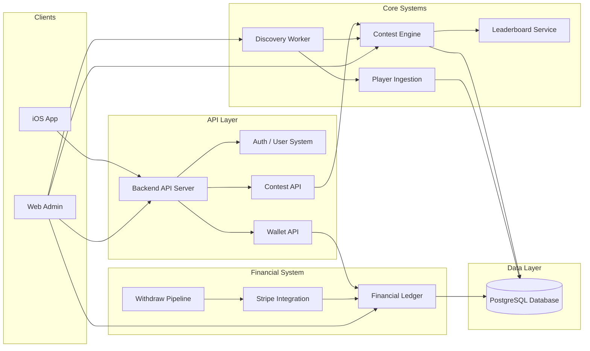

# System Blueprint
67 Enterprises – Playoff Challenge Platform

Purpose

This document provides a visual blueprint of the system architecture and data flows.

The blueprint aligns with governance tower documentation so engineers and AI agents can:

- understand system boundaries
- follow high-level data flows
- trace integrations
- correlate architecture with governance documentation

Typical usage:

Left side → System Blueprint Diagram  
Right side → Governance Tower Documents

This allows developers to visually trace the architecture while reviewing system rules.

---

# System Architecture Towers

The platform is organized into the following architecture towers:

01-platform-architecture  
02-contest-engine  
03-financial-ledger  
04-discovery-system  
05-user-system  
06-admin-operations  
07-api-contracts  
08-client-lock  
09-ai-governance  
10-production-runbooks  

Each tower contains the canonical governance documentation for that subsystem.

---

# High-Level System Blueprint



---

# System Data Flows

## User Onboarding Flow

User → Apple Login → API → User Creation → Wallet Initialization

Key Systems

- User System
- Authentication
- Wallet initialization

---

## Contest Discovery Flow

ESPN API → Discovery Worker → Contest Templates → Contest Instances

Key Systems

- Discovery Worker
- Contest Engine
- Database

### Discovery Template Binding Rule

**External Event (provider_event_id)**
↓
**Template Binding (contest_templates.provider_tournament_id)**
↓
**Contest Instance Creation**

**Constraint Enforcement:**
```
UNIQUE(provider_event_id, template_id, entry_fee_cents)
```

**Purpose:**
- Ensures discovery idempotency
- Prevents duplicate contest instances
- Guarantees deterministic contest generation

**Implementation Note:**
The discovery system binds external provider events to templates via `provider_tournament_id`. This binding is idempotent and ensures that replaying discovery does not create duplicate contests or templates.

---

## Contest Entry Flow

User → Join Contest → Wallet Debit → Ledger Entry → Contest Entry Recorded

Key Systems

- Contest Engine
- Wallet API
- Financial Ledger

---

## Lineup Submission Flow

User → Submit Lineup → Contest Validation → Picks Stored

Key Systems

- Player Ingestion
- Contest Engine
- Picks storage

---

## Leaderboard Flow

Player Scores → Ingestion → Contest Scoring → Leaderboard Update

Key Systems

- Ingestion pipeline
- Contest scoring engine
- Leaderboard service

---

## Deposit Flow

User → Deposit → Stripe → Ledger Credit → Wallet Balance Update

Key Systems

- Stripe integration
- Financial ledger

---

## Withdraw Flow

User → Withdraw Request → Ledger Debit → Stripe Payout

Key Systems

- Withdraw pipeline
- Stripe integration
- Financial ledger

---

# Financial Invariant

The platform enforces the following invariant:

SUM(ledger credits) - SUM(ledger debits) = wallet balances

The ledger is:

- append only
- never mutated
- never deleted

---

# Admin Operations

Web Admin provides operational tooling for:

- contest creation
- entry tier management
- marketing contest flag
- refund entry
- cancel contest
- replay discovery
- reconciliation
- financial dashboards
- user lookup

Admin operations must follow governance rules defined in:

docs/governance/06-admin-operations/

---

# API Contract Governance

API contracts (OpenAPI specifications) are frozen using cryptographic snapshots to ensure stability and auditability.

## Contract Freeze Lifecycle

```
Develop API → Generate Spec → Compute SHA256 → Check Snapshot → Version → Freeze
                                                    ↓
                                           Already exists?
                                            ↓         ↓
                                          YES       NO
                                           ↓         ↓
                                        Exit 0   Insert v1,v2,v3...
```

## Freezing Process

```bash
# Public API (available now)
npm run freeze:openapi

# Planned command (Phase 2 implementation):
# npm run freeze:openapi:admin
# Requires: freeze-openapi-admin.js script
```

## Contract Snapshot Storage

**Table:** `api_contract_snapshots`

**Columns:**
- `contract_name` (public-api, admin-api)
- `version` (v1, v2, v3...)
- `sha256` (cryptographic hash of spec)
- `spec_json` (full OpenAPI spec)
- `created_at` (timestamp)

**Unique Constraint:** `(contract_name, sha256)` — prevents duplicate hashes

## Idempotency Guarantee

Freezing the same spec multiple times:
1. Computes identical SHA256
2. Detects existing snapshot
3. Exits successfully without creating duplicate
4. No database churn

## Version Computation

Versions auto-increment based on existing snapshots:
```sql
SELECT COALESCE(MAX(REPLACE(version,'v','')::int), 0) + 1
FROM api_contract_snapshots
WHERE contract_name = 'public-api'
```

## Governance Rules

- API changes MUST be frozen before deployment
- Tests prevent deployment if OpenAPI changes without freezing
- Contract history is immutable and append-only
- Workers must understand contract authority (frozen boundaries)

**Reference:**
- `backend/scripts/freeze-openapi.js`
- `backend/contracts/openapi.yaml`
- `backend/contracts/openapi-admin.yaml`
- `docs/governance/ARCHITECTURE_LOCK.md` (OpenAPI Contracts section)

---

# AI Governance Integration

AI agents must reference governance towers before implementing changes.

Required loading order:

1 AI_ENTRYPOINT.md  
2 AI_WORKER_RULES.md  
3 CLAUDE_RULES.md  
4 Governance tower documentation  

AI agents must never invent architecture that contradicts governance.

---

# Blueprint Maintenance Rule

When system architecture changes:

1 Update governance tower documentation  
2 Update this SYSTEM_BLUEPRINT.md diagram  
3 Verify blueprint reflects real system behavior  

Documentation must remain driftless with the running system.

---

End of Document