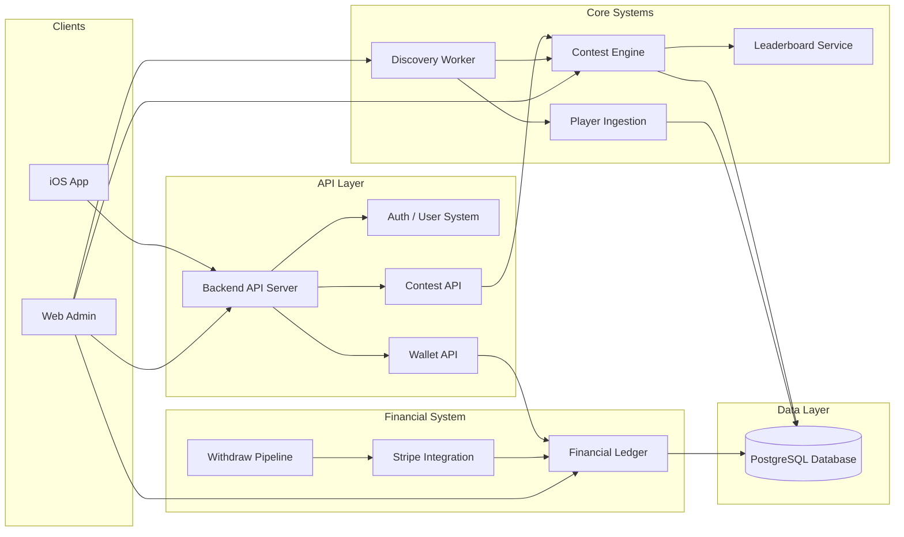

# System Blueprint
67 Enterprises – Playoff Challenge Platform

Purpose

This document provides a visual blueprint of the system architecture and data flows.

The blueprint aligns with governance tower documentation so engineers and AI agents can:

- understand system boundaries
- follow high-level data flows
- trace integrations
- correlate architecture with governance documentation

Typical usage:

Left side → System Blueprint Diagram  
Right side → Governance Tower Documents

This allows developers to visually trace the architecture while reviewing system rules.

---

# System Architecture Towers

The platform is organized into the following architecture towers:

01-platform-architecture  
02-contest-engine  
03-financial-ledger  
04-discovery-system  
05-user-system  
06-admin-operations  
07-api-contracts  
08-client-lock  
09-ai-governance  
10-production-runbooks  

Each tower contains the canonical governance documentation for that subsystem.

---

# High-Level System Blueprint



---

# System Data Flows

## User Authentication Flow

Clients authenticate using one of three endpoints:

1. **POST /api/users** — Apple Sign In
2. **POST /api/auth/register** — Email/password signup
3. **POST /api/auth/login** — Email/password login

### Authentication Response

All three endpoints return:
```json
{
  "id": "uuid",
  "email": "user@example.com",
  "username": "string",
  "created_at": "ISO-8601",
  "token": "jwt-bearer-token"
}
```

### Token Storage and Usage

**Backend:**
- Issues JWT token in user response after successful authentication
- Verifies token signature on all authenticated requests
- Extracts user ID from `sub` claim
- Rejects requests with invalid or missing tokens (401 Unauthorized)

**iOS Client:**
- **AuthService** stores token in `authToken` property and UserDefaults
- **APIService** retrieves token from AuthService on each request
- Includes token in all authenticated requests:
  ```
  Authorization: Bearer <token>
  X-User-Id: <user-id-uuid>  (backward compatibility)
  ```
- Maintains stateless architecture (APIService does not store tokens)

### Token Details

- **Algorithm:** HS256
- **Secret:** `JWT_SECRET` environment variable
- **Expiration:** 24 hours
- **Claims:**
  - `sub` = user.id
  - `user_id` = user.id
  - `email` = user.email

---

## User Onboarding Flow

User → Apple Login → API → User Creation → Wallet Initialization

Key Systems

- User System
- Authentication
- Wallet initialization

---

## Contest Discovery Flow

ESPN API → Discovery Worker → Contest Templates → Contest Instances

### Discovery Worker

**Inputs:**
- Provider calendar (ESPN PGA API)

**Processing:**
1. Pull full event calendar from provider
2. Filter events by discovery window (14 days from current time)
3. For each event in window:
   - Check if system template exists (via provider_tournament_id)
   - Create template if not exists
   - Create contest instances for template (multiple entry fee tiers)
4. Skip events that already have templates (idempotent)

**Output:**
- contest_templates rows (system-generated PGA_TOURNAMENT type)
- contest_instances rows (platform-owned contests)

**Guarantees:**
- Idempotent (templates checked before creation)
- Deterministic ordering (events sorted by start_time)
- No duplicate templates (unique constraint enforced)

**Key Systems**

- Discovery Worker
- Contest Engine
- Database

### Discovery Template Binding Rule

**External Event (provider_event_id)**
↓
**Template Binding (contest_templates.provider_tournament_id)**
↓
**Contest Instance Creation**

**Constraint Enforcement:**
```
UNIQUE(provider_event_id, template_id, entry_fee_cents)
```

**Purpose:**
- Ensures discovery idempotency
- Prevents duplicate contest instances
- Guarantees deterministic contest generation

**Implementation Note:**
The discovery system binds external provider events to templates via `provider_tournament_id`. This binding is idempotent and ensures that replaying discovery does not create duplicate contests or templates. Discovery processes all events in the 14-day window in a single cycle, ensuring no tournaments are skipped.

---

## Contest Entry Flow

User → Join Contest → Wallet Debit → Ledger Entry → Contest Entry Recorded

Key Systems

- Contest Engine
- Wallet API
- Financial Ledger

---

## Lineup Submission Flow

User → Submit Lineup → Contest Validation → Picks Stored

Key Systems

- Player Ingestion
- Contest Engine
- Picks storage

---

## Leaderboard Flow

Player Scores → Ingestion → Contest Scoring → Leaderboard Update

Key Systems

- Ingestion pipeline
- Contest scoring engine
- Leaderboard service

---

## Deposit Flow

User → Deposit → Stripe → Ledger Credit → Wallet Balance Update

Key Systems

- Stripe integration
- Financial ledger

---

## Withdraw Flow

User → Withdraw Request → Ledger Debit → Stripe Payout

Key Systems

- Withdraw pipeline
- Stripe integration
- Financial ledger

---

# Financial Invariant

The platform enforces the following invariant:

SUM(ledger credits) - SUM(ledger debits) = wallet balances

The ledger is:

- append only
- never mutated
- never deleted

---

# Sport Derivation Model

## Purpose

Sport type is deterministically derived from `template_type` on the backend. The backend is the authoritative source of truth for sport classification. Clients must never infer, compute, or override sport values.

## Derivation Rules

| Template Type Prefix | Sport Value |
|---------------------|-------------|
| NFL_* | nfl |
| PGA_* | golf |
| NBA_* | basketball |
| MLB_* | baseball |
| (default) | unknown |

## Implementation

**Backend:** `backend/services/helpers/deriveSportFromTemplateType.js`

```javascript
function deriveSportFromTemplateType(templateType) {
  if (!templateType) return 'unknown'
  if (templateType.startsWith('NFL')) return 'nfl'
  if (templateType.startsWith('PGA')) return 'golf'
  if (templateType.startsWith('NBA')) return 'basketball'
  if (templateType.startsWith('MLB')) return 'baseball'
  return 'unknown'
}
```

## API Response

All contest endpoints include `sport` field derived from `template_type`:

```json
{
  "contest_id": "uuid",
  "type": "PGA_TOURNAMENT",
  "sport": "golf",
  "template_type": "PGA_TOURNAMENT"
}
```

## Client Behavior

**iOS Requirements:**
- ✅ Accept `sport` field from API response
- ✅ Display sport value in UI
- ✅ Use sport for correct player pool selection
- ❌ Do NOT compute sport from template_type
- ❌ Do NOT use fallbacks like "default nfl"
- ❌ Do NOT override backend sport value

**Contract Definition:**
- `ContestDetailResponseContract.swift` — sport: String (required)
- `ContestListItemDTO.swift` — sport: String (required)
- Domain mapping — `Contest.sport = Sport(contract.sport)`

## Governance

- Backend is authoritative for sport classification
- Clients must trust backend values without inference
- `template_sport` field is deprecated and removed from API responses
- Sport derivation is deterministic and replayable

---

# Admin Operations

Web Admin provides operational tooling for:

- contest creation
- entry tier management
- marketing contest flag
- refund entry
- cancel contest
- replay discovery
- reconciliation
- financial dashboards
- user lookup

Admin operations must follow governance rules defined in:

docs/governance/06-admin-operations/

---

# API Contract Governance

API contracts (OpenAPI specifications) are frozen using cryptographic snapshots to ensure stability and auditability.

## Contract Freeze Lifecycle

```
Develop API → Generate Spec → Compute SHA256 → Check Snapshot → Version → Freeze
                                                    ↓
                                           Already exists?
                                            ↓         ↓
                                          YES       NO
                                           ↓         ↓
                                        Exit 0   Insert v1,v2,v3...
```

## Freezing Process

```bash
# Public API (available now)
npm run freeze:openapi

# Planned command (Phase 2 implementation):
# npm run freeze:openapi:admin
# Requires: freeze-openapi-admin.js script
```

## Contract Snapshot Storage

**Table:** `api_contract_snapshots`

**Columns:**
- `contract_name` (public-api, admin-api)
- `version` (v1, v2, v3...)
- `sha256` (cryptographic hash of spec)
- `spec_json` (full OpenAPI spec)
- `created_at` (timestamp)

**Unique Constraint:** `(contract_name, sha256)` — prevents duplicate hashes

## Idempotency Guarantee

Freezing the same spec multiple times:
1. Computes identical SHA256
2. Detects existing snapshot
3. Exits successfully without creating duplicate
4. No database churn

## Version Computation

Versions auto-increment based on existing snapshots:
```sql
SELECT COALESCE(MAX(REPLACE(version,'v','')::int), 0) + 1
FROM api_contract_snapshots
WHERE contract_name = 'public-api'
```

## Contest API Response Model

**New Field (v1.1):** `template_sport`

The Contest Detail endpoint (`GET /api/custom-contests/{id}`) now includes explicit sport metadata:

```json
{
  "id": "...",
  "template_sport": "GOLF",
  "template_type": "PGA_DAILY",
  "status": "SCHEDULED",
  "is_locked": false,
  "is_live": false,
  "can_join": true,
  ...
}
```

**Purpose:**
Allows clients (iOS app) to deterministically select sport-specific logic without inferring from template type.

**Client Usage:**
```swift
if contest.template_sport == "GOLF" {
    // Load PGA players
} else if contest.template_sport == "NFL" {
    // Load NFL players
}
```

**Backwards Compatibility:** Safe additive change. Clients not using this field continue to function.

## Governance Rules

- API changes MUST be frozen before deployment
- Tests prevent deployment if OpenAPI changes without freezing
- Contract history is immutable and append-only
- Workers must understand contract authority (frozen boundaries)

**Reference:**
- `backend/scripts/freeze-openapi.js`
- `backend/contracts/openapi.yaml`
- `backend/contracts/openapi-admin.yaml`
- `docs/governance/ARCHITECTURE_LOCK.md` (OpenAPI Contracts section)

---

# Contest Lifecycle Start-Time Authority

## Problem

The contest lifecycle state machine must use the correct timestamp field to determine when contests transition between states. Using the wrong field causes premature state transitions.

## Rules

1. **Discovery Never Sets start_time**
   - Discovery creates contests with `status = SCHEDULED` and `start_time = NULL`
   - Discovery populates only: `tournament_start_time`, `tournament_end_time`, `lock_time`
   - `start_time` must never be written during contest creation

2. **Lifecycle Engine Sets start_time Only on LIVE Transition**
   - When a contest transitions SCHEDULED → LOCKED → LIVE, the lifecycle engine writes `start_time` to mark the exact moment of the LIVE transition
   - This timestamp has historical significance: it records when the contest actually became live

3. **State Machine Authority**
   - **SCHEDULED → LOCKED:** Depends on `lock_time <= now`
   - **LOCKED → LIVE:** Depends on `tournament_start_time <= now` (NOT `start_time`)
   - **LIVE → COMPLETE:** Depends on `tournament_end_time <= now`
   - If `start_time` exists before tournament_start_time is reached, it indicates corrupted state

## Example Lifecycle Timeline

```
Time: 2026-03-13 04:00 UTC
Contest Created
├─ status: SCHEDULED
├─ start_time: NULL
├─ lock_time: 2026-03-13 07:00 UTC
└─ tournament_start_time: 2026-03-19 07:00 UTC

Time: 2026-03-13 07:00 UTC
lock_time reached → Transition to LOCKED
├─ status: LOCKED
├─ start_time: NULL
└─ tournament_start_time: 2026-03-19 07:00 UTC

Time: 2026-03-19 07:00 UTC
tournament_start_time reached → Transition to LIVE
├─ status: LIVE
├─ start_time: 2026-03-19 07:00 UTC  ← Lifecycle engine writes this now
└─ tournament_end_time: 2026-03-19 19:00 UTC

Time: 2026-03-19 19:00 UTC
tournament_end_time reached → Transition to COMPLETE
├─ status: COMPLETE
├─ settle_time: 2026-03-19 19:00 UTC (set by settlement engine)
└─ [Contest is now settled]
```

## Implementation Authority

- **File:** `backend/services/helpers/contestLifecycleAdvancer.js`
- **Function:** `advanceContestLifecycleIfNeeded()`
- **Constraint:** Must check `tournament_start_time`, never `start_time`

## Repair Tool

If contests are incorrectly marked LIVE with future `tournament_start_time`:

```bash
node backend/scripts/repairIncorrectContestStartTimes.js --dryrun
node backend/scripts/repairIncorrectContestStartTimes.js
```

See `docs/operations/CONTEST_REPAIR.md` for operational guidance.

---

# AI Governance Integration

AI agents must reference governance towers before implementing changes.

Required loading order:

1 AI_ENTRYPOINT.md  
2 AI_WORKER_RULES.md  
3 CLAUDE_RULES.md  
4 Governance tower documentation  

AI agents must never invent architecture that contradicts governance.

---

# Blueprint Maintenance Rule

When system architecture changes:

1 Update governance tower documentation  
2 Update this SYSTEM_BLUEPRINT.md diagram  
3 Verify blueprint reflects real system behavior  

Documentation must remain driftless with the running system.

---

End of Document