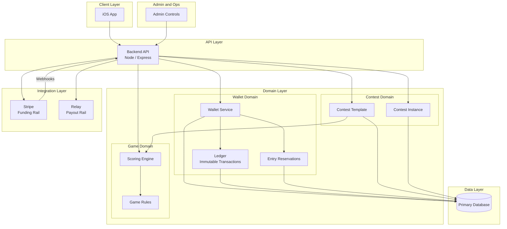

# March Madness Release Plan

## Executive Summary

This document outlines the enterprise delivery plan for March Madness with a target date of March 10. The plan is sequenced by dependency and blast radius, not desirability.

**Competing Objectives:**
- Ship March Madness with minimal friction
- Avoid damaging long-term architecture with rushed shortcuts

---

## Guiding Principles

1. **Revenue path before polish** - If users cannot fund, join, and pay out contests reliably, everything else is noise.

2. **Isolation beats completeness** - New systems must be isolated behind feature flags or environment boundaries. No shared risk with existing live flows.

3. **One abstraction pass only** - Every abstraction added must survive March Madness and NFL next season. No time for iterative refactors.

4. **Manual backstops are acceptable** - Admin tooling and fallbacks are allowed if they reduce system risk.

---

## Phased Delivery Plan

### Phase 0: Environment Safety Net (Immediate)

**Deliverable:** Lower environment (staging)

> This is not optional. It is the first move.

**Why:**
- Payment logic without staging is unacceptable
- Custom contests introduce combinatorial risk
- Need a place to test Stripe webhooks, wallet balance changes, and contest joins safely

**Scope:**
- Separate Stripe keys and webhook endpoints
- Separate database or schema
- Feature flag support at app boot
- Admin-only access acceptable

**Duration:** 1-2 days max. Anything longer means overengineering.

---

### Phase 1: Money Foundation (Core Revenue Path)

**Deliverables:** Payment automation + UI enhancements for internal wallet

> These are inseparable. Treat them as one epic.

**Architectural Stance:**
- Wallet is the system of record
- Stripe is a funding rail, not a balance authority
- Relay is a payout rail, not a ledger

**Minimum Viable Wallet:**
- Balance table
- Ledger table with immutable entries
- Pending vs available funds
- Contest entry reservations

**UI Scope:**
- View balance
- Add funds
- See recent transactions
- Use wallet when joining contest

**Explicit Non-Goals for March 10:**
- No peer-to-peer transfers
- No refunds automation beyond admin override
- No partial payouts

> If wallet is not ready, March Madness onboarding fails. Period.

---

### Phase 2: Contest Model Expansion (Critical Enabler)

**Deliverable:** Custom contest support

> This is the hardest architectural decision and must be done cleanly once.

**Correct Abstraction:**

| Contest Template | Contest Instance |
|------------------|------------------|
| Game type | Owner |
| Rules | Join code |
| Entry fee | Player list |
| Max players | State |
| Scoring logic reference | Prize pool |

**Key Rule:** Custom contests are instances, not forks. Never clone rules or scoring logic. Reference them.

**Join Code Requirements:**
- Short
- Human-readable
- Unique per instance
- Expirable (optional)

**Unlocks:**
- Private March Madness pools
- Office pools
- Friends and family use cases

> Without this, growth is capped.

---

### Phase 3: User Entry and Navigation (UX Critical)

**Deliverables:**
- UI to create or join custom games
- UI to view and switch between games

> These are tightly coupled and should be designed together.

**Navigation Model:**
- User belongs to many contests
- Contest is the primary context
- Game type is secondary

**UI Requirements:**
- Create contest flow
- Join via code
- List active contests
- Clear indicator of current contest
- Wallet balance visible in context

**Defer:**
- Contest discovery marketplace
- Search
- Recommendations

> You only need intentional joins right now.

---

## Timeline

**Assumption:** 3-person effective team or equivalent focus

| Days | Deliverable |
|------|-------------|
| 1-2 | Staging + Stripe isolation |
| 3-5 | Wallet backend + UI |
| 6-8 | Custom contest backend |
| 9-10 | Contest join/create UI |
| Buffer | Bug fixes and rollout |

> This is aggressive but realistic only if scope discipline is enforced.

---

## Tradeoffs

### Acceptable Compromises
- Admin-assisted refunds
- Manual contest cancellation
- Limited transaction history
- No analytics
- No notifications beyond basics

### Unacceptable Compromises
- Incorrect balances
- Contest entry without funds
- Double charges
- Inconsistent contest state

---

## Final Recommendation Summary

**To make March Madness succeed:**

1. Build staging first
2. Finish wallet and payment flow
3. Implement contest instances cleanly
4. Enable users to create, join, and switch contests
5. Ignore everything else

---

## Platform Architecture

### 1. Client Layer

**iOS App**
- Primary user interface
- Handles: Authentication, contest discovery/join/create, wallet balance display, contest context switching
- Feature-flag aware (prod vs staging)
- No business logic beyond validation and presentation

> **Key Rule:** Client is stateless with respect to money and contest rules.

---

### 2. API Layer

**Backend API (Node/Express)**
- Single source of truth for: Wallet balances, contest state, game rules
- Versioned endpoints: `/wallet`, `/contests`, `/entries`, `/games`
- Enforces: Authorization, contest eligibility, funds availability
- Environment-aware (prod vs staging config)

> **Key Rule:** All state transitions are server-authoritative.

---

### 3. Domain Layer

#### Wallet Domain

| Component | Description |
|-----------|-------------|
| Wallet | User-scoped, available balance, pending balance |
| Ledger | Immutable transaction records, credits, debits, holds |
| Reservation | Temporary hold for contest entry, settled or released |

> Stripe and Relay never mutate wallet state directly.

#### Contest Domain

| Contest Template | Contest Instance |
|------------------|------------------|
| Game type (Playoff Challenge, March Madness) | Owner |
| Ruleset reference | Join code |
| Entry fee | Participants |
| Scoring engine reference | Prize pool |
| | State (open, locked, completed) |

> Custom contests are instances referencing templates, never copies.

#### Game Domain
- Encapsulates sport-specific logic
- Scoring engines are modular and referenced
- Contest instances bind to a game engine at creation

---

### 4. Integration Layer

| System | Role | Notes |
|--------|------|-------|
| Stripe | Funding rail only | Handles card payments, deposits. Communicates via webhooks. Never queried for balance. |
| Relay | Payout rail only | Executes disbursements post-contest. Triggered by backend settlement logic. |

> **Key Rule:** External systems are asynchronous and non-authoritative.

---

### 5. Data Layer

**Primary Database Tables:**
- Users
- Wallets
- Ledger entries
- Contest templates
- Contest instances
- Contest entries

**Environment Isolation:**
- Separate staging and production databases
- No shared Stripe keys
- No cross-environment data access

---

### 6. Admin and Safety Controls

**Admin Capabilities:**
- Manual refunds
- Contest cancellation
- Wallet adjustment (audited)
- Environment locks

**Operational Safeguards:**
- Idempotent payment handling
- Webhook replay protection
- Feature flags for incomplete UI

---

### 7. Flow Summary (Happy Path)

1. User funds wallet via Stripe
2. Stripe webhook credits wallet ledger
3. User creates or joins contest
4. Entry fee reserved from wallet
5. Contest completes
6. Backend settles ledger
7. Relay executes payouts

---

### Architectural North Star

- Wallet is the system of record
- Contest instances are isolated, not forked
- External services are rails, not brains
- Staging exists to break things safely

---

## Legal and Compliance

### Executive Summary

Using college athlete names and photos is fundamentally different from using NFL players.

| League | Licensing |
|--------|-----------|
| NFL | Names and likenesses are collectively licensed through the NFLPA. Fantasy sports has decades of precedent. |
| College | No collective licensing body. NIL rights belong to individual athletes. Images are highest-risk. Names are lower risk but not risk-free. |

> You must make an explicit architectural and product decision now or risk having to pull March Madness mid-tournament.

---

### Risk Breakdown by Asset Type

#### 1. Player Photos - HIGHEST RISK

**Do not ship with photos.**

**Why:**
- Photos invoke right of publicity directly
- No blanket NIL license exists
- Universities do not grant rights for commercial use
- Even scraped or "public" images are not safe

**Guidance:** Do not display college athlete photos. Use team logos or silhouettes instead.

---

#### 2. Player Names - MODERATE RISK

Generally acceptable if positioned correctly.

**Key Distinction:** Facts vs endorsement. Names used as factual identifiers in a game are treated differently than marketing assets.

**Industry Precedent:** ESPN, Yahoo, CBS use names under fantasy sports informational use.

**Litigation risk increases if:**
- Names are highlighted in marketing
- Players are used in ads
- NIL value is implied

**Mitigation Steps:**
- Use names only inside gameplay
- No player-centric marketing
- Clear fantasy sports disclaimers

---

#### 3. Team Names and Logos - MANAGEABLE RISK

- NCAA tournament name and logo are trademarked
- Team logos are usually licensed separately

**Safe Approach:**
- Use team names as text
- Avoid official tournament branding
- Do not say "March Madness" in product UI unless licensed
- Use "College Basketball Tournament" internally

---

### Compliance-Safe Architecture Decision

**Ship with:**
- Player names only
- Team text identifiers
- No player photos
- No NIL language
- No athlete-focused promotions

**Do NOT ship:**
- Headshots
- Action photos
- Player profile pages
- Jersey likenesses

---

### Required Disclaimers

Add in Terms and footer:

> "This game is not affiliated with or endorsed by the NCAA or any university."

> "Player names are used for informational and gameplay purposes only."

> "No rights are claimed in athlete names or likenesses."

---

### Architectural Implication

In the Game Domain, define Player Representation as:
- `display_name`
- `team`
- `position`
- `no_image_url` enforced at schema or API layer

> Do not let the client decide this. Make it impossible to accidentally add photos later without intentional change.

---

### Long-Term Path (Post-March Madness)

If March Madness proves traction:
- Explore NIL group licensing
- Explore third-party data providers with bundled rights
- Consider playerless formats (team-based scoring)

> None of this is required to ship safely now.

---

### Bottom Line

**Ship with names only, no photos, conservative branding** = lowest-risk lane available without delaying launch.

**Ship with photos** = gambling the entire product window.

---

## Payment Automation Details

### Complete Payment Flow

#### Step 1: User Funds Wallet via Stripe

**Within your app, not the Stripe UI.**

- User taps "Add Funds" in app
- App opens Stripe-hosted payment sheet or embedded Stripe component
- User enters card or uses Apple Pay
- User never sees Stripe branding beyond the payment sheet

> Stripe handles payment entry and processing. You control the UX and intent. Stripe is not a user-facing wallet in your product.

---

#### Step 2: Stripe Webhook Credits Wallet Ledger

Stripe does not confirm a "Stripe account balance" for the user.

**Correct Model:**
1. User pays X dollars
2. Stripe processes the charge
3. Stripe sends webhook to backend confirming payment success
4. Backend:
   - Verifies event signature
   - Reads amount from webhook payload
   - Creates credit entry in internal wallet ledger
   - Updates user's available wallet balance
5. App displays updated wallet balance

> **Key Rule:** Stripe is not your balance authority. Your wallet ledger is.

---

#### Step 3: User Creates or Joins Contest

No money moves externally here.

---

#### Step 4: Entry Fee Reserved from Wallet

**Should not be permanently subtracted yet.**

**Correct Handling:**
- Wallet has: Available balance + Reserved balance
- When user joins: Entry fee moves from available to reserved
- Total wallet balance remains unchanged
- Prevents double spending while contest is active

> Do not hard subtract at this stage.

---

#### Step 5: Contest Completes

Contest is locked. No more joins or exits.

---

#### Step 6: Backend Settles Ledger

**This is the accounting step.**

What happens:
- Reserved entry fees are finalized
- Prize pool is calculated
- Winners are determined
- Ledger entries created for losses and winnings
- Winners have an entitlement, not money movement yet

> Still no external transfers.

---

#### Step 7: Relay Executes Payouts

Directly to user's bank, but not necessarily the same account they paid from.

**Important:**
- Funding method and payout destination are separate
- Users should add a payout bank account explicitly and verify it once
- Relay sends funds to user's linked bank account

> Do not assume card in equals bank out. That assumption breaks quickly.

---

#### Step 8: Wallet Ledger Records Payout

**Two categories of wallet funds:**

**A. Winnings from Contests**
- Automatically paid out via Relay
- Wallet ledger shows: Credit for winnings, Debit for payout
- Net effect: Wallet balance returns to pre-contest baseline
- User does not need to cash out winnings. It just happens.

**B. Unused Wallet Funds**
- Example: User deposits $50, joins contest for $10, loses. Wallet still has $40.
- User can leave funds for future contests or initiate manual cash-out

**Cash-out Flow:**
1. User taps "Withdraw"
2. Backend validates balance
3. Relay executes payout
4. Wallet ledger records debit

---

### The Correct Mental Model

- Stripe brings money into your platform
- Wallet tracks entitlement and availability
- Contests consume and redistribute entitlements
- Relay moves money out of your platform
- Wallet is never the final resting place for winnings by default

---

### Authoritative Flow Summary

1. User adds funds inside app using Stripe payment sheet
2. Stripe webhook confirms payment; backend credits wallet ledger
3. User creates or joins contest
4. Entry fee moves from available to reserved wallet balance
5. Contest completes
6. Backend settles ledger and determines winnings
7. Relay pays winners directly to linked bank accounts
8. Wallet ledger records payout debits and closes contest
9. Unused wallet balance remains available or can be withdrawn on demand

---

## Appendix: Architecture Diagram

---

## Next Steps (Options)

- Produce a 1-page architecture diagram description
- Break this into Jira-ready epics and stories
- Define go/no-go criteria for March 10
- Stress-test this plan for failure modes
- Annotate architecture diagram with compliance boundaries
- Draft exact disclaimer language
- Define a "safe data contract" for college player objects
- Redline March Madness UI for risk exposure
- Define wallet table schemas
- Draft exact webhook handling rules
- Create sequence diagrams for funding and payout
- Flag regulatory thresholds
