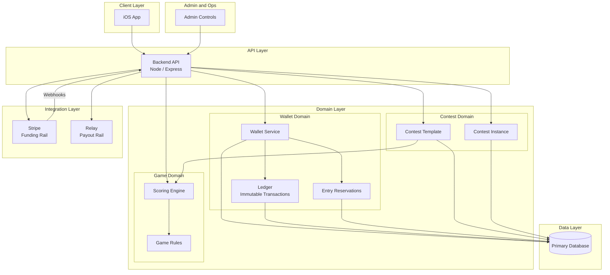

# March Madness Release Plan

## Executive Summary

This document outlines the enterprise delivery plan for March Madness with a target date of March 10. The plan is sequenced by dependency and blast radius, not desirability.

**Competing Objectives:**
- Ship March Madness with minimal friction
- Avoid damaging long-term architecture with rushed shortcuts

---

## Guiding Principles

1. **Revenue path before polish** - If users cannot fund, join, and pay out contests reliably, everything else is noise.

2. **Isolation beats completeness** - New systems must be isolated behind feature flags or environment boundaries. No shared risk with existing live flows.

3. **One abstraction pass only** - Every abstraction added must survive March Madness and NFL next season. No time for iterative refactors.

4. **Manual backstops are acceptable** - Admin tooling and fallbacks are allowed if they reduce system risk.

---

## Engineering Standards

All development work across all phases must adhere to these engineering standards. These are non-negotiable requirements that protect the codebase and ensure maintainability.

---

### Test-First Development (TDD)

**Write unit tests before writing implementation code.**

Tests serve as executable requirements. They define the boundaries of what the feature must do and must not do. All tests must fail initially with descriptive error messages.

#### Test Writing Requirements

1. **Tests are written first** - No implementation code is written until tests exist
2. **Tests must fail initially** - A passing test before implementation indicates a bad test
3. **Error messages must be diagnostic** - Failures must clearly indicate:
   - What was expected
   - What was received
   - Which requirement was violated
   - Exact location (file, function, line)

#### Error Message Standards

Every test failure must include:

| Component | Description | Example |
|-----------|-------------|---------|
| Requirement ID | Links to specific requirement | `[WALLET-001]` |
| Expected behavior | What should have happened | `Expected balance to be 50.00` |
| Actual behavior | What actually happened | `Received balance of 0.00` |
| Context | Relevant state information | `User: test-user-123, Transaction: deposit` |
| Location | File and function | `wallet.service.ts:creditBalance()` |

#### Example Test Pattern

```typescript
describe('WalletService.creditBalance', () => {
  it('[WALLET-001] should increase available balance when funds are deposited', async () => {
    // Arrange
    const userId = 'test-user-123';
    const depositAmount = 50.00;
    const initialBalance = await walletService.getBalance(userId);

    // Act
    const result = await walletService.creditBalance(userId, depositAmount);

    // Assert
    expect(result.availableBalance).toBe(
      initialBalance.availableBalance + depositAmount,
      `[WALLET-001] Balance increment failed.
       Expected: ${initialBalance.availableBalance + depositAmount}
       Received: ${result.availableBalance}
       Context: userId=${userId}, depositAmount=${depositAmount}
       Location: wallet.service.ts:creditBalance()`
    );
  });
});
```

#### Test Categories by Phase

| Phase | Test Suites Required |
|-------|---------------------|
| Phase 0 | Environment detection, feature flag evaluation, config isolation |
| Phase 1 | Wallet CRUD, ledger immutability, balance calculations, reservation lifecycle |
| Phase 2 | Template validation, instance creation, join code generation, state transitions |
| Phase 3 | Contest listing, context switching, UI state management |

#### Pre-Implementation Checklist

Before writing any implementation code:

- [ ] All acceptance criteria converted to test cases
- [ ] All test cases written and failing
- [ ] Error messages reviewed for diagnostic clarity
- [ ] Edge cases identified and tested
- [ ] Integration points mocked appropriately

> Tests are the specification. If it's not tested, it's not a requirement.

---

### SOLID Principles Compliance

All new code and modifications must adhere to SOLID principles. These are mandatory, not aspirational.

#### Single Responsibility Principle (SRP)

Each class/module has one reason to change.

**Enforcement:**
- Services handle business logic only
- Controllers handle HTTP concerns only
- Repositories handle data access only
- No god classes or utility dumping grounds

**Example - Wallet Domain:**
| Class | Single Responsibility |
|-------|----------------------|
| `WalletService` | Balance business logic |
| `WalletRepository` | Wallet data persistence |
| `WalletController` | HTTP request/response handling |
| `LedgerService` | Transaction recording |

---

#### Open/Closed Principle (OCP)

Classes are open for extension, closed for modification.

**Enforcement:**
- Use interfaces for all service dependencies
- New game types extend base abstractions
- Scoring engines are pluggable, not hardcoded
- Feature additions should not modify existing working code

**Example - Contest Domain:**
```
ContestTemplate (abstract)
  ├── PlayoffChallengeTemplate
  ├── MarchMadnessTemplate
  └── [Future game types extend, never modify base]
```

---

#### Liskov Substitution Principle (LSP)

Subtypes must be substitutable for their base types.

**Enforcement:**
- All contest types work through the `ContestTemplate` interface
- All scoring engines work through the `ScoringEngine` interface
- No type checking or casting in business logic
- Tests verify substitutability

---

#### Interface Segregation Principle (ISP)

Clients should not depend on interfaces they don't use.

**Enforcement:**
- Small, focused interfaces
- No "fat" interfaces with optional methods
- Separate read and write interfaces where appropriate

**Example:**
```
IWalletReader    → getBalance(), getTransactions()
IWalletWriter    → creditBalance(), debitBalance()
IWalletReserver  → createReservation(), releaseReservation()
```

---

#### Dependency Inversion Principle (DIP)

High-level modules don't depend on low-level modules. Both depend on abstractions.

**Enforcement:**
- All services receive dependencies via constructor injection
- No direct instantiation of dependencies
- External services (Stripe, Relay) accessed through interfaces
- Database access through repository interfaces

**Example:**
```typescript
// Correct
class WalletService {
  constructor(
    private readonly walletRepo: IWalletRepository,
    private readonly ledgerService: ILedgerService
  ) {}
}

// Incorrect - violates DIP
class WalletService {
  private walletRepo = new WalletRepository();
}
```

---

### Phase Impact Analysis

Each phase must document its impact on existing components before implementation begins.

#### Protected Components (Must Not Break)

| Component | Owner | Phase Contact Points |
|-----------|-------|---------------------|
| Authentication routes | Core | Phase 1 (wallet requires auth) |
| User registration | Core | Phase 1 (wallet creation on signup) |
| Existing contest flow | Core | Phase 2 (template abstraction) |
| Current API contracts | Core | All phases (versioning required) |
| Database schema | Core | Phase 1, 2 (migrations) |

#### Phase 0 Impact Assessment

| Existing Component | Impact | Mitigation |
|--------------------|--------|------------|
| Authentication | None | Staging uses same auth system |
| User data | None | Separate database/schema |
| API routes | None | Environment-based routing |
| Stripe integration | Low | Separate API keys, same code paths |

#### Phase 1 Impact Assessment

| Existing Component | Impact | Mitigation |
|--------------------|--------|------------|
| Authentication | Low | Wallet endpoints use existing auth middleware |
| User model | Medium | Add wallet relationship, migration required |
| API routes | Low | New `/wallet` routes, no changes to existing |
| Database | Medium | New tables, no modifications to existing |

#### Phase 2 Impact Assessment

| Existing Component | Impact | Mitigation |
|--------------------|--------|------------|
| Existing contests | High | Must migrate to template/instance model |
| Contest creation | High | New abstraction layer |
| Scoring logic | Medium | Extract to pluggable engines |
| API routes | Medium | New `/contests` structure, deprecate old |

#### Phase 3 Impact Assessment

| Existing Component | Impact | Mitigation |
|--------------------|--------|------------|
| Navigation | Medium | New contest context switching |
| UI state | Medium | Multi-contest state management |
| API routes | Low | Consumes Phase 2 endpoints |

---

### Regression Safeguards

No phase ships without passing regression requirements.

#### Regression Test Suite Requirements

**Core Regression Suite (Must Pass Every Phase):**
- [ ] User can register
- [ ] User can login
- [ ] User can logout
- [ ] Auth tokens validate correctly
- [ ] Auth tokens expire correctly
- [ ] Protected routes reject unauthenticated requests
- [ ] Existing API contracts return expected shapes
- [ ] Database connections work
- [ ] Error responses follow standard format

**Phase-Specific Regression (Cumulative):**

| After Phase | Additional Regression Tests |
|-------------|----------------------------|
| Phase 0 | Environment switching, feature flags, config isolation |
| Phase 1 | + Wallet balance accuracy, ledger integrity, Stripe webhook handling |
| Phase 2 | + Contest creation, join codes, template/instance relationship |
| Phase 3 | + Multi-contest navigation, context switching, UI state |

#### Rollback Strategy

Every phase must have a documented rollback procedure.

| Phase | Rollback Trigger | Rollback Procedure |
|-------|------------------|-------------------|
| Phase 0 | Staging breaks prod | Revert environment config, disable feature flags |
| Phase 1 | Balance errors, payment failures | Feature flag disable, manual wallet freeze, revert migrations |
| Phase 2 | Contest state corruption | Feature flag disable, restore contest table from backup |
| Phase 3 | UI breaks existing flows | Feature flag disable, deploy previous UI build |

#### Feature Flag Kill Switches

Every new capability must be behind a feature flag that can be disabled instantly.

| Feature | Flag Name | Default (Prod) | Default (Staging) |
|---------|-----------|----------------|-------------------|
| Wallet UI | `WALLET_ENABLED` | false | true |
| Add Funds | `WALLET_FUNDING_ENABLED` | false | true |
| Custom Contests | `CUSTOM_CONTESTS_ENABLED` | false | true |
| Contest Join Codes | `JOIN_CODES_ENABLED` | false | true |
| Multi-Contest View | `MULTI_CONTEST_ENABLED` | false | true |

---

### Dependency Contracts

Phases must not break each other through explicit interface contracts.

#### Contract Definition Requirements

Before Phase N can use output from Phase N-1:
1. Interface must be defined and documented
2. Contract tests must exist
3. Both phases must pass contract tests
4. No phase can modify another phase's contract without version bump

#### Phase Contracts

**Phase 0 → Phase 1 Contract:**
```typescript
interface IEnvironmentConfig {
  isStaging(): boolean;
  getStripeKey(): string;
  getDatabaseUrl(): string;
  getFeatureFlag(name: string): boolean;
}
```

**Phase 1 → Phase 2 Contract:**
```typescript
interface IWalletService {
  getBalance(userId: string): Promise<WalletBalance>;
  createReservation(userId: string, amount: number, contestId: string): Promise<Reservation>;
  settleReservation(reservationId: string, outcome: 'win' | 'loss'): Promise<void>;
}

interface WalletBalance {
  available: number;
  reserved: number;
  total: number;
}
```

**Phase 2 → Phase 3 Contract:**
```typescript
interface IContestService {
  createInstance(templateId: string, ownerId: string): Promise<ContestInstance>;
  joinByCode(code: string, userId: string): Promise<JoinResult>;
  getUserContests(userId: string): Promise<ContestInstance[]>;
  getContestState(contestId: string): Promise<ContestState>;
}
```

#### Contract Test Requirements

Each contract must have tests verifying:
- All interface methods exist
- Return types match specification
- Error cases return expected error types
- No breaking changes to existing methods

> A phase is not complete until its contract tests pass and downstream phases can consume its interfaces.

---

### Contest Onboarding Strategy

New contests must be onboardable through configuration, not code. The goal is zero deployments for standard contest additions.

#### Onboarding Tiers

| Tier | Effort | What's Required | Example |
|------|--------|-----------------|---------|
| **Tier 1: Config Only** | Minutes | Admin UI or config file | New March Madness pool with standard rules |
| **Tier 2: Data Only** | Hours | Database seed + config | New NFL season with updated teams/schedule |
| **Tier 3: Code Required** | Days | New scoring engine | Entirely new sport or rule system |

> **Target:** 90% of new contests should be Tier 1 or Tier 2.

---

#### Configuration-Driven Contest Templates

Contest templates are stored in the database, not in code. New game types that use existing scoring logic require no deployment.

**Template Schema (Extensible):**

```
contest_templates
├── id (UUID)
├── name (string)
├── game_type (string) → references game_types table
├── scoring_engine_id (string) → references scoring_engines table
├── rules_config (JSONB) → flexible rule parameters
├── entry_fee_options (JSONB) → array of allowed entry fees
├── max_players_options (JSONB) → array of allowed sizes
├── payout_structure_id → references payout_structures table
├── is_active (boolean)
├── created_at (timestamp)
└── updated_at (timestamp)
```

**Key Design Decisions:**

| Decision | Rationale |
|----------|-----------|
| `rules_config` is JSONB | New rule parameters don't require schema migration |
| `scoring_engine_id` is a reference | Engines are reusable across templates |
| `entry_fee_options` is an array | Multiple fee tiers without code changes |
| `payout_structure_id` is a reference | Payout logic is shared and versioned |

---

#### Scoring Engine Registry

Scoring engines are registered in the database and loaded dynamically. Adding a new engine requires code, but using an existing engine does not.

**Scoring Engine Schema:**

```
scoring_engines
├── id (string) → e.g., "nfl_playoff_2024", "ncaa_bracket_2024"
├── name (string)
├── description (string)
├── handler_class (string) → maps to code implementation
├── config_schema (JSONB) → defines valid config parameters
├── is_active (boolean)
└── created_at (timestamp)
```

**Pre-Built Engines (No Code Required to Use):**

| Engine ID | Supports |
|-----------|----------|
| `nfl_playoff_standard` | NFL Playoff bracket picks |
| `ncaa_bracket_standard` | March Madness bracket picks |
| `weekly_picks` | Weekly game picks (any sport) |
| `survivor_pool` | Elimination-style picks |

> New contest using existing engine = Tier 1 (config only)

---

#### Payout Structure Registry

Payout structures are data, not code.

**Payout Structure Schema:**

```
payout_structures
├── id (UUID)
├── name (string) → e.g., "Winner Take All", "Top 3 Split"
├── distribution (JSONB) → e.g., [{"place": 1, "percentage": 100}]
├── min_players (integer)
├── max_players (integer)
└── is_active (boolean)
```

**Example Distributions:**

```json
// Winner Take All
[{"place": 1, "percentage": 100}]

// Top 3 (50/30/20)
[
  {"place": 1, "percentage": 50},
  {"place": 2, "percentage": 30},
  {"place": 3, "percentage": 20}
]

// Top 10% Split
[{"place_percentile": 10, "percentage": 100, "split": "equal"}]
```

---

#### Game Data Management

Teams, players, schedules, and matchups are data, not code.

**Game Data Tables:**

```
game_types
├── id (string) → e.g., "nfl", "ncaa_basketball"
├── name (string)
├── sport (string)
└── is_active (boolean)

seasons
├── id (UUID)
├── game_type_id → references game_types
├── year (integer)
├── name (string) → e.g., "2024-2025 NFL Season"
├── start_date (date)
├── end_date (date)
└── is_active (boolean)

teams
├── id (UUID)
├── game_type_id → references game_types
├── name (string)
├── abbreviation (string)
├── metadata (JSONB) → conference, division, etc.
└── is_active (boolean)

matchups
├── id (UUID)
├── season_id → references seasons
├── home_team_id → references teams
├── away_team_id → references teams
├── scheduled_at (timestamp)
├── round (string) → e.g., "Wild Card", "Sweet 16"
├── status (string) → scheduled, in_progress, final
├── result (JSONB) → scores, winner, etc.
└── lock_at (timestamp) → when picks lock
```

> **New season onboarding:** Import teams + matchups via admin UI or data pipeline. No code changes.

---

#### Onboarding Runbook: New Contest Type

**Tier 1: New Contest Using Existing Template Pattern**

| Step | Action | Who | Time |
|------|--------|-----|------|
| 1 | Create contest instance via Admin UI | Ops | 2 min |
| 2 | Set entry fee, max players, payout structure | Ops | 2 min |
| 3 | Generate join code | System | Automatic |
| 4 | Test in staging | QA | 10 min |
| 5 | Enable in production | Ops | 1 min |

**Tier 2: New Season/Tournament**

| Step | Action | Who | Time |
|------|--------|-----|------|
| 1 | Create season record | Ops/Data | 5 min |
| 2 | Import teams (if new) | Data Pipeline | 15 min |
| 3 | Import matchups/schedule | Data Pipeline | 15 min |
| 4 | Create contest template (if new combination) | Ops | 10 min |
| 5 | Verify scoring engine compatibility | Dev | 30 min |
| 6 | Test full flow in staging | QA | 1 hour |
| 7 | Enable in production | Ops | 5 min |

**Tier 3: New Scoring Engine (Code Required)**

| Step | Action | Who | Time |
|------|--------|-----|------|
| 1 | Define scoring rules specification | Product | — |
| 2 | Write scoring engine class | Dev | — |
| 3 | Write unit tests for engine | Dev | — |
| 4 | Register engine in database | Dev | 5 min |
| 5 | Create template using new engine | Ops | 10 min |
| 6 | Full regression test | QA | — |
| 7 | Deploy | Dev | — |

---

#### What Requires Code vs Config vs Data

| Change Type | Code | Config/DB | Example |
|-------------|------|-----------|---------|
| New pool with existing rules | No | Yes | Another March Madness bracket pool |
| New entry fee tier | No | Yes | Add $50 option to existing template |
| New payout structure | No | Yes | Create "Top 5 Split" distribution |
| New team | No | Yes | Expansion team joins league |
| New season schedule | No | Yes | Import next year's matchups |
| New scoring algorithm | **Yes** | Yes | Golf tournament scoring |
| New sport entirely | **Yes** | Yes | Add NHL support |
| UI for new game type | **Yes** | No | Custom bracket visualization |

---

#### Admin UI Requirements for Contest Onboarding

The admin interface must support Tier 1 and Tier 2 onboarding without developer involvement.

**Required Admin Capabilities:**

- [ ] Create/edit contest templates
- [ ] Create/edit payout structures
- [ ] Create/edit seasons
- [ ] Import teams (CSV/JSON upload)
- [ ] Import matchups (CSV/JSON upload)
- [ ] Create contest instances from templates
- [ ] View/manage active contests
- [ ] Override contest state (emergency)
- [ ] Preview scoring calculations

> **Rule:** If Ops needs to file a ticket for a Tier 1 or Tier 2 contest, the system has failed.

---

## Phased Delivery Plan

### Phase 0: Environment Safety Net (Immediate)

**Deliverable:** Lower environment (staging)

> This is not optional. It is the first move.

**Why:**
- Payment logic without staging is unacceptable
- Custom contests introduce combinatorial risk
- Need a place to test Stripe webhooks, wallet balance changes, and contest joins safely

**Scope:**
- Separate Stripe keys and webhook endpoints
- Separate database or schema
- Feature flag support at app boot
- Admin-only access acceptable

**Duration:** 1-2 days max. Anything longer means overengineering.

---

### Phase 1: Money Foundation (Core Revenue Path)

**Deliverables:** Payment automation + UI enhancements for internal wallet

> These are inseparable. Treat them as one epic.

**Architectural Stance:**
- Wallet is the system of record
- Stripe is a funding rail, not a balance authority
- Relay is a payout rail, not a ledger

**Minimum Viable Wallet:**
- Balance table
- Ledger table with immutable entries
- Pending vs available funds
- Contest entry reservations

**UI Scope:**
- View balance
- Add funds
- See recent transactions
- Use wallet when joining contest

**Explicit Non-Goals for March 10:**
- No peer-to-peer transfers
- No refunds automation beyond admin override
- No partial payouts

> If wallet is not ready, March Madness onboarding fails. Period.

---

### Phase 2: Contest Model Expansion (Critical Enabler)

**Deliverable:** Custom contest support

> This is the hardest architectural decision and must be done cleanly once.

**Correct Abstraction:**

| Contest Template | Contest Instance |
|------------------|------------------|
| Game type | Owner |
| Rules | Join code |
| Entry fee | Player list |
| Max players | State |
| Scoring logic reference | Prize pool |

**Key Rule:** Custom contests are instances, not forks. Never clone rules or scoring logic. Reference them.

**Join Code Requirements:**
- Short
- Human-readable
- Unique per instance
- Expirable (optional)

**Unlocks:**
- Private March Madness pools
- Office pools
- Friends and family use cases

> Without this, growth is capped.

---

### Phase 3: User Entry and Navigation (UX Critical)

**Deliverables:**
- UI to create or join custom games
- UI to view and switch between games

> These are tightly coupled and should be designed together.

**Navigation Model:**
- User belongs to many contests
- Contest is the primary context
- Game type is secondary

**UI Requirements:**
- Create contest flow
- Join via code
- List active contests
- Clear indicator of current contest
- Wallet balance visible in context

**Defer:**
- Contest discovery marketplace
- Search
- Recommendations

> You only need intentional joins right now.

---

## Timeline

**Assumption:** 3-person effective team or equivalent focus

| Days | Deliverable |
|------|-------------|
| 1-2 | Staging + Stripe isolation |
| 3-5 | Wallet backend + UI |
| 6-8 | Custom contest backend |
| 9-10 | Contest join/create UI |
| Buffer | Bug fixes and rollout |

> This is aggressive but realistic only if scope discipline is enforced.

---

## Tradeoffs

### Acceptable Compromises
- Admin-assisted refunds
- Manual contest cancellation
- Limited transaction history
- No analytics
- No notifications beyond basics

### Unacceptable Compromises
- Incorrect balances
- Contest entry without funds
- Double charges
- Inconsistent contest state

---

## Final Recommendation Summary

**To make March Madness succeed:**

1. Build staging first
2. Finish wallet and payment flow
3. Implement contest instances cleanly
4. Enable users to create, join, and switch contests
5. Ignore everything else

---

## Platform Architecture

### 1. Client Layer

**iOS App**
- Primary user interface
- Handles: Authentication, contest discovery/join/create, wallet balance display, contest context switching
- Feature-flag aware (prod vs staging)
- No business logic beyond validation and presentation

> **Key Rule:** Client is stateless with respect to money and contest rules.

---

### 2. API Layer

**Backend API (Node/Express)**
- Single source of truth for: Wallet balances, contest state, game rules
- Versioned endpoints: `/wallet`, `/contests`, `/entries`, `/games`
- Enforces: Authorization, contest eligibility, funds availability
- Environment-aware (prod vs staging config)

> **Key Rule:** All state transitions are server-authoritative.

---

### 3. Domain Layer

#### Wallet Domain

| Component | Description |
|-----------|-------------|
| Wallet | User-scoped, available balance, pending balance |
| Ledger | Immutable transaction records, credits, debits, holds |
| Reservation | Temporary hold for contest entry, settled or released |

> Stripe and Relay never mutate wallet state directly.

#### Contest Domain

| Contest Template | Contest Instance |
|------------------|------------------|
| Game type (Playoff Challenge, March Madness) | Owner |
| Ruleset reference | Join code |
| Entry fee | Participants |
| Scoring engine reference | Prize pool |
| | State (open, locked, completed) |

> Custom contests are instances referencing templates, never copies.

#### Game Domain
- Encapsulates sport-specific logic
- Scoring engines are modular and referenced
- Contest instances bind to a game engine at creation

---

### 4. Integration Layer

| System | Role | Notes |
|--------|------|-------|
| Stripe | Funding rail only | Handles card payments, deposits. Communicates via webhooks. Never queried for balance. |
| Relay | Payout rail only | Executes disbursements post-contest. Triggered by backend settlement logic. |

> **Key Rule:** External systems are asynchronous and non-authoritative.

---

### 5. Data Layer

**Primary Database Tables:**
- Users
- Wallets
- Ledger entries
- Contest templates
- Contest instances
- Contest entries

**Environment Isolation:**
- Separate staging and production databases
- No shared Stripe keys
- No cross-environment data access

---

### 6. Admin and Safety Controls

**Admin Capabilities:**
- Manual refunds
- Contest cancellation
- Wallet adjustment (audited)
- Environment locks

**Operational Safeguards:**
- Idempotent payment handling
- Webhook replay protection
- Feature flags for incomplete UI

---

### 7. Flow Summary (Happy Path)

1. User funds wallet via Stripe
2. Stripe webhook credits wallet ledger
3. User creates or joins contest
4. Entry fee reserved from wallet
5. Contest completes
6. Backend settles ledger
7. Relay executes payouts

---

### Architectural North Star

- Wallet is the system of record
- Contest instances are isolated, not forked
- External services are rails, not brains
- Staging exists to break things safely

---

## Legal and Compliance

### Executive Summary

Using college athlete names and photos is fundamentally different from using NFL players.

| League | Licensing |
|--------|-----------|
| NFL | Names and likenesses are collectively licensed through the NFLPA. Fantasy sports has decades of precedent. |
| College | No collective licensing body. NIL rights belong to individual athletes. Images are highest-risk. Names are lower risk but not risk-free. |

> You must make an explicit architectural and product decision now or risk having to pull March Madness mid-tournament.

---

### Risk Breakdown by Asset Type

#### 1. Player Photos - HIGHEST RISK

**Do not ship with photos.**

**Why:**
- Photos invoke right of publicity directly
- No blanket NIL license exists
- Universities do not grant rights for commercial use
- Even scraped or "public" images are not safe

**Guidance:** Do not display college athlete photos. Use team logos or silhouettes instead.

---

#### 2. Player Names - MODERATE RISK

Generally acceptable if positioned correctly.

**Key Distinction:** Facts vs endorsement. Names used as factual identifiers in a game are treated differently than marketing assets.

**Industry Precedent:** ESPN, Yahoo, CBS use names under fantasy sports informational use.

**Litigation risk increases if:**
- Names are highlighted in marketing
- Players are used in ads
- NIL value is implied

**Mitigation Steps:**
- Use names only inside gameplay
- No player-centric marketing
- Clear fantasy sports disclaimers

---

#### 3. Team Names and Logos - MANAGEABLE RISK

- NCAA tournament name and logo are trademarked
- Team logos are usually licensed separately

**Safe Approach:**
- Use team names as text
- Avoid official tournament branding
- Do not say "March Madness" in product UI unless licensed
- Use "College Basketball Tournament" internally

---

### Compliance-Safe Architecture Decision

**Ship with:**
- Player names only
- Team text identifiers
- No player photos
- No NIL language
- No athlete-focused promotions

**Do NOT ship:**
- Headshots
- Action photos
- Player profile pages
- Jersey likenesses

---

### Required Disclaimers

Add in Terms and footer:

> "This game is not affiliated with or endorsed by the NCAA or any university."

> "Player names are used for informational and gameplay purposes only."

> "No rights are claimed in athlete names or likenesses."

---

### Architectural Implication

In the Game Domain, define Player Representation as:
- `display_name`
- `team`
- `position`
- `no_image_url` enforced at schema or API layer

> Do not let the client decide this. Make it impossible to accidentally add photos later without intentional change.

---

### Long-Term Path (Post-March Madness)

If March Madness proves traction:
- Explore NIL group licensing
- Explore third-party data providers with bundled rights
- Consider playerless formats (team-based scoring)

> None of this is required to ship safely now.

---

### Bottom Line

**Ship with names only, no photos, conservative branding** = lowest-risk lane available without delaying launch.

**Ship with photos** = gambling the entire product window.

---

## Payment Automation Details

### Complete Payment Flow

#### Step 1: User Funds Wallet via Stripe

**Within your app, not the Stripe UI.**

- User taps "Add Funds" in app
- App opens Stripe-hosted payment sheet or embedded Stripe component
- User enters card or uses Apple Pay
- User never sees Stripe branding beyond the payment sheet

> Stripe handles payment entry and processing. You control the UX and intent. Stripe is not a user-facing wallet in your product.

---

#### Step 2: Stripe Webhook Credits Wallet Ledger

Stripe does not confirm a "Stripe account balance" for the user.

**Correct Model:**
1. User pays X dollars
2. Stripe processes the charge
3. Stripe sends webhook to backend confirming payment success
4. Backend:
   - Verifies event signature
   - Reads amount from webhook payload
   - Creates credit entry in internal wallet ledger
   - Updates user's available wallet balance
5. App displays updated wallet balance

> **Key Rule:** Stripe is not your balance authority. Your wallet ledger is.

---

#### Step 3: User Creates or Joins Contest

No money moves externally here.

---

#### Step 4: Entry Fee Reserved from Wallet

**Should not be permanently subtracted yet.**

**Correct Handling:**
- Wallet has: Available balance + Reserved balance
- When user joins: Entry fee moves from available to reserved
- Total wallet balance remains unchanged
- Prevents double spending while contest is active

> Do not hard subtract at this stage.

---

#### Step 5: Contest Completes

Contest is locked. No more joins or exits.

---

#### Step 6: Backend Settles Ledger

**This is the accounting step.**

What happens:
- Reserved entry fees are finalized
- Prize pool is calculated
- Winners are determined
- Ledger entries created for losses and winnings
- Winners have an entitlement, not money movement yet

> Still no external transfers.

---

#### Step 7: Relay Executes Payouts

Directly to user's bank, but not necessarily the same account they paid from.

**Important:**
- Funding method and payout destination are separate
- Users should add a payout bank account explicitly and verify it once
- Relay sends funds to user's linked bank account

> Do not assume card in equals bank out. That assumption breaks quickly.

---

#### Step 8: Wallet Ledger Records Payout

**Two categories of wallet funds:**

**A. Winnings from Contests**
- Automatically paid out via Relay
- Wallet ledger shows: Credit for winnings, Debit for payout
- Net effect: Wallet balance returns to pre-contest baseline
- User does not need to cash out winnings. It just happens.

**B. Unused Wallet Funds**
- Example: User deposits $50, joins contest for $10, loses. Wallet still has $40.
- User can leave funds for future contests or initiate manual cash-out

**Cash-out Flow:**
1. User taps "Withdraw"
2. Backend validates balance
3. Relay executes payout
4. Wallet ledger records debit

---

### The Correct Mental Model

- Stripe brings money into your platform
- Wallet tracks entitlement and availability
- Contests consume and redistribute entitlements
- Relay moves money out of your platform
- Wallet is never the final resting place for winnings by default

---

### Authoritative Flow Summary

1. User adds funds inside app using Stripe payment sheet
2. Stripe webhook confirms payment; backend credits wallet ledger
3. User creates or joins contest
4. Entry fee moves from available to reserved wallet balance
5. Contest completes
6. Backend settles ledger and determines winnings
7. Relay pays winners directly to linked bank accounts
8. Wallet ledger records payout debits and closes contest
9. Unused wallet balance remains available or can be withdrawn on demand

---

## Appendix: Architecture Diagram



---

## Next Steps (Options)

- Produce a 1-page architecture diagram description
- Break this into Jira-ready epics and stories
- Define go/no-go criteria for March 10
- Stress-test this plan for failure modes
- Annotate architecture diagram with compliance boundaries
- Draft exact disclaimer language
- Define a "safe data contract" for college player objects
- Redline March Madness UI for risk exposure
- Define wallet table schemas
- Draft exact webhook handling rules
- Create sequence diagrams for funding and payout
- Flag regulatory thresholds
