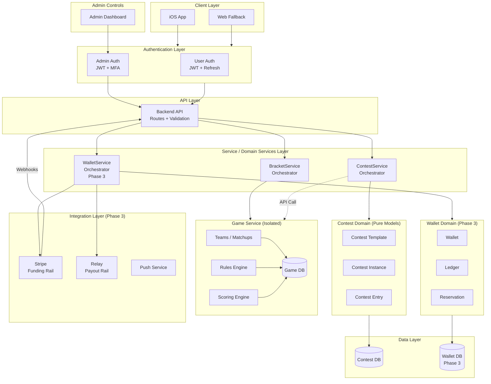

# March Madness Release Plan

## Executive Summary

This document outlines the enterprise delivery plan for March Madness with a target date of March 10. The plan is sequenced by dependency and blast radius, not desirability.

**Competing Objectives:**
- Ship March Madness with minimal friction
- Avoid damaging long-term architecture with rushed shortcuts

---

## App Store Compliance Strategy

This plan is designed to support iterative App Store submissions. Each phase represents a fully functional release candidate that can pass Apple review without exposing incomplete or placeholder features.

### Core Compliance Principles

1. **Feature completeness per submission** - Any App Store submission only exposes fully functional features. No disabled buttons, grayed-out options, or "coming soon" placeholders.

2. **Feature flags remove UI entirely** - When a feature is flagged off, its UI elements are completely absent from the app, not merely disabled or hidden behind interactions.

3. **Free contests until payment phase** - Phase 1 and Phase 2 are free-contest-only releases from the user's perspective. Users will not see, interact with, or be blocked by any payment-related flows.

4. **Backend scaffolding is invisible** - Payment-related fields, interfaces, and services may exist in the backend as architectural scaffolding, but they are not user-visible until Phase 3.

5. **No implied monetization** - No UI flow suggests payments, fees, balances, or wallets until the payment phase is explicitly enabled.

### Phase-to-Release Mapping

| Phase | App Store Posture | User Experience |
|-------|-------------------|-----------------|
| Phase 0 | Internal only (TestFlight) | Staging environment, no public release |
| Phase 1 | Submittable | Free contests with shareable links |
| Phase 2 | Submittable | Free bracket contests (March Madness) |
| Phase 3 | Submittable | Paid contests with wallet and payouts |

> **Rule:** A phase is not App Store ready until all exposed features are complete and no payment-related UI is visible (prior to Phase 3).

---

## Guiding Principles

1. **Functional completeness before monetization** - Users must be able to create, join, and complete contests reliably. Payment automation is an enhancement built on a working foundation.

2. **Isolation beats completeness** - New systems must be isolated behind feature flags or environment boundaries. No shared risk with existing live flows.

3. **One abstraction pass only** - Every abstraction added must survive March Madness and NFL next season. No time for iterative refactors.

4. **Manual backstops are acceptable** - Admin tooling and fallbacks are allowed if they reduce system risk.

---

## Engineering Standards

All development work across all phases must adhere to these engineering standards. These are non-negotiable requirements that protect the codebase and ensure maintainability.

---

### Test-First Development (TDD)

**Write unit tests before writing implementation code.**

Tests serve as executable requirements. They define the boundaries of what the feature must do and must not do. All tests must fail initially with descriptive error messages.

#### Test Writing Requirements

1. **Tests are written first** - No implementation code is written until tests exist
2. **Tests must fail initially** - A passing test before implementation indicates a bad test
3. **Error messages must be diagnostic** - Failures must clearly indicate:
   - What was expected
   - What was received
   - Which requirement was violated
   - Exact location (file, function, line)

#### Error Message Standards

Every test failure must include:

| Component | Description | Example |
|-----------|-------------|---------|
| Requirement ID | Links to specific requirement | `[WALLET-001]` |
| Expected behavior | What should have happened | `Expected balance to be 50.00` |
| Actual behavior | What actually happened | `Received balance of 0.00` |
| Context | Relevant state information | `User: test-user-123, Transaction: deposit` |
| Location | File and function | `wallet.service.ts:creditBalance()` |

#### Example Test Pattern

```typescript
describe('WalletService.creditBalance', () => {
  it('[WALLET-001] should increase available balance when funds are deposited', async () => {
    // Arrange
    const userId = 'test-user-123';
    const depositAmount = 50.00;
    const initialBalance = await walletService.getBalance(userId);

    // Act
    const result = await walletService.creditBalance(userId, depositAmount);

    // Assert
    expect(result.availableBalance).toBe(
      initialBalance.availableBalance + depositAmount,
      `[WALLET-001] Balance increment failed.
       Expected: ${initialBalance.availableBalance + depositAmount}
       Received: ${result.availableBalance}
       Context: userId=${userId}, depositAmount=${depositAmount}
       Location: wallet.service.ts:creditBalance()`
    );
  });
});
```

#### Test Categories by Phase

| Phase | Test Suites Required |
|-------|---------------------|
| Phase 0 | Environment detection, feature flag evaluation, config isolation |
| Phase 1 | Contest instance CRUD, join code/token generation, deep link parsing, owner settings validation, player cap enforcement, onboarding flow state |
| Phase 2 | Bracket validation, team/matchup data integrity, scoring calculations, leaderboard ranking, deadline enforcement |
| Phase 3 | Wallet CRUD, ledger immutability, balance calculations, reservation lifecycle, payment gating |

#### Pre-Implementation Checklist

Before writing any implementation code:

- [ ] All acceptance criteria converted to test cases
- [ ] All test cases written and failing
- [ ] Error messages reviewed for diagnostic clarity
- [ ] Edge cases identified and tested
- [ ] Integration points mocked appropriately

> Tests are the specification. If it's not tested, it's not a requirement.

---

### SOLID Principles Compliance

All new code and modifications must adhere to SOLID principles. These are mandatory, not aspirational.

#### Single Responsibility Principle (SRP)

Each class/module has one reason to change.

**Enforcement:**
- API Layer: Route handling and request validation only
- Service Layer: Business logic orchestration only
- Domain Layer: Pure data models only (no logic)
- Repository Layer: Data access only
- No god classes or utility dumping grounds

**Example - Layered Architecture:**
| Layer | Class | Single Responsibility |
|-------|-------|----------------------|
| API | `ContestController` | HTTP request/response handling |
| Service | `ContestService` | Contest business logic orchestration |
| Service | `WalletService` | Wallet/payment orchestration |
| Domain | `ContestInstance` | Pure data model (no methods) |
| Repository | `ContestRepository` | Contest data persistence |
| Integration | `StripeIntegration` | Stripe API communication |

**Anti-Pattern to Avoid:**
```typescript
// BAD - Service doing too much
class ContestService {
  async createContest() { /* business logic */ }
  async formatResponse() { /* HTTP concern - belongs in controller */ }
  async saveToDb() { /* data access - belongs in repository */ }
  async callStripe() { /* integration - belongs in integration layer */ }
}

// GOOD - Single responsibility
class ContestService {
  constructor(
    private contestRepo: IContestRepository,
    private gameService: IGameService
  ) {}
  async createContest() { /* orchestration only */ }
}
```

---

#### Open/Closed Principle (OCP)

Classes are open for extension, closed for modification.

**Enforcement:**
- Use interfaces for all service dependencies
- New game types plug into Game Service without modifying it
- Scoring engines are registered, not hardcoded
- Feature additions should not modify existing working code

**Example - Game Service Extensibility:**
```
GameService
  └── ScoringEngineRegistry
        ├── NCAABracketScorer (registered)
        ├── NFLPlayoffScorer (registered)
        └── [New scorers register, never modify GameService]
```

---

#### Liskov Substitution Principle (LSP)

Subtypes must be substitutable for their base types.

**Enforcement:**
- All scoring engines work through the `IScoringEngine` interface
- Game types are interchangeable in Contest creation
- No type checking or casting in business logic
- Tests verify substitutability

**Example - Scoring Engines:**
```typescript
// Any scorer can be used wherever IScoringEngine is expected
interface IScoringEngine {
  calculateScore(picks: unknown, results: MatchResult[]): number;
  getRoundMultiplier(round: string): number;
}

// Both implement the same interface, fully substitutable
class NCAABracketScorer implements IScoringEngine { }
class NFLPlayoffScorer implements IScoringEngine { }
```

---

#### Interface Segregation Principle (ISP)

Clients should not depend on interfaces they don't use.

**Enforcement:**
- Small, focused interfaces
- No "fat" interfaces with optional methods
- Separate read and write interfaces where appropriate
- Service layer consumes only the interfaces it needs

**Example - Segregated Interfaces:**
```typescript
// Wallet interfaces segregated by consumer needs
IWalletReader    → getBalance(), getTransactions()
IWalletWriter    → creditBalance(), debitBalance()
IWalletReserver  → createReservation(), releaseReservation()

// ContestService only needs reservation capability
class ContestService {
  constructor(private walletReserver: IWalletReserver) {}
  // Doesn't depend on getBalance() or creditBalance()
}

// Game Service interface segregated
IGameReader      → getGameTypes(), getTeams(), getMatchups()
IGameValidator   → validatePicks(), checkDeadline()
IGameScorer      → calculateScore(), getLeaderboard()
```

---

#### Dependency Inversion Principle (DIP)

High-level modules don't depend on low-level modules. Both depend on abstractions.

**Enforcement:**
- All services receive dependencies via constructor injection
- No direct instantiation of dependencies
- Game Service accessed through interface, not direct import
- Database access through repository interfaces
- Integration layer accessed through interfaces

**Example - Service Layer Dependencies:**
```typescript
// CORRECT - All dependencies are interfaces
class ContestService {
  constructor(
    private readonly contestRepo: IContestRepository,
    private readonly gameService: IGameService,      // Interface to isolated service
    private readonly walletService: IWalletReserver  // Segregated interface
  ) {}

  async createContest(settings: ContestSettings) {
    // Validate with Game Service (no direct coupling)
    const validation = await this.gameService.validateGameType(settings.gameTypeId);
    // ...
  }
}

// INCORRECT - Direct dependencies
class ContestService {
  private contestRepo = new ContestRepository();    // Direct instantiation
  private gameService = new GameService();          // Tight coupling
}
```

**Cross-Service Communication:**
```typescript
// Game Service is isolated - accessed only through interface
interface IGameService {
  getAvailableGameTypes(): Promise<GameType[]>;
  validatePicks(gameTypeId: string, picks: unknown): Promise<ValidationResult>;
  calculateScore(gameTypeId: string, picks: unknown): Promise<number>;
}

// ContestService doesn't know Game Service implementation details
// Could be same process, separate service, or external API
```

---

### Phase Impact Analysis

Each phase must document its impact on existing components before implementation begins.

#### Protected Components (Must Not Break)

| Component | Owner | Phase Contact Points |
|-----------|-------|---------------------|
| Authentication routes | Core | Phase 1 (contest join requires auth) |
| User registration | Core | Phase 1 (onboarding flow) |
| Current API contracts | Core | All phases (versioning required) |
| Database schema | Core | Phase 1, 2 (migrations) |
| App routing | Core | Phase 1 (deep link handling) |

#### Phase 0 Impact Assessment

| Existing Component | Impact | Mitigation |
|--------------------|--------|------------|
| Authentication | None | Staging uses same auth system |
| User data | None | Separate database/schema |
| API routes | None | Environment-based routing |
| App navigation | None | Feature flag isolation |

#### Phase 1 Impact Assessment

| Existing Component | Impact | Mitigation |
|--------------------|--------|------------|
| Authentication | Low | Contest endpoints use existing auth middleware |
| User model | Low | Add contest ownership relationship |
| API routes | Medium | New `/contests` routes, deep link handlers |
| Database | Medium | New tables (contest_instances, templates) |
| App routing | High | Universal/App Links integration |
| Onboarding flow | Medium | Insert contest context into existing flow |

#### Phase 2 Impact Assessment

| Existing Component | Impact | Mitigation |
|--------------------|--------|------------|
| Contest system | Low | Adds game type, uses Phase 1 infrastructure |
| Database | Medium | Game data tables (teams, matchups, brackets) |
| Scoring logic | Medium | New scoring engine, pluggable architecture |
| API routes | Low | New `/brackets` endpoints |

#### Phase 3 Impact Assessment

| Existing Component | Impact | Mitigation |
|--------------------|--------|------------|
| Contest join flow | Medium | Add payment gate before join |
| User model | Medium | Add wallet relationship |
| API routes | Low | New `/wallet` routes |
| Database | Medium | New tables (wallets, ledger) |

---

### Regression Safeguards

No phase ships without passing regression requirements.

#### Regression Test Suite Requirements

**Core Regression Suite (Must Pass Every Phase):**
- [ ] User can register
- [ ] User can login
- [ ] User can logout
- [ ] Auth tokens validate correctly
- [ ] Auth tokens expire correctly
- [ ] Protected routes reject unauthenticated requests
- [ ] Existing API contracts return expected shapes
- [ ] Database connections work
- [ ] Error responses follow standard format

**Phase-Specific Regression (Cumulative):**

| After Phase | Additional Regression Tests |
|-------------|----------------------------|
| Phase 0 | Environment switching, feature flags, config isolation |
| Phase 1 | + Contest creation, join link generation, deep link parsing, onboarding flow, player cap enforcement |
| Phase 2 | + Bracket submission, scoring accuracy, leaderboard ranking, deadline locking |
| Phase 3 | + Wallet balance accuracy, ledger integrity, payment gating, Stripe webhook handling |

#### Rollback Strategy

Every phase must have a documented rollback procedure.

| Phase | Rollback Trigger | Rollback Procedure |
|-------|------------------|-------------------|
| Phase 0 | Staging breaks prod | Revert environment config, disable feature flags |
| Phase 1 | Join links broken, onboarding fails | Feature flag disable, revert deep link config, restore contest tables |
| Phase 2 | Scoring errors, bracket corruption | Feature flag disable, restore bracket data from backup |
| Phase 3 | Balance errors, payment failures | Feature flag disable, manual wallet freeze, revert migrations |

#### Feature Flag Kill Switches

Every new capability must be behind a feature flag that can be disabled instantly.

| Feature | Flag Name | Default (Prod) | Default (Staging) |
|---------|-----------|----------------|-------------------|
| Custom Contests | `CUSTOM_CONTESTS_ENABLED` | false | true |
| Deep Link Join | `DEEP_LINK_JOIN_ENABLED` | false | true |
| Contest Creation UI | `CONTEST_CREATION_ENABLED` | false | true |
| March Madness | `MARCH_MADNESS_ENABLED` | false | true |
| Bracket UI | `BRACKET_UI_ENABLED` | false | true |
| Payments | `PAYMENTS_ENABLED` | false | true |
| Wallet UI | `WALLET_ENABLED` | false | true |

**App Store Compliance Note:** When `PAYMENTS_ENABLED` is false:
- Wallet UI is completely absent from the app (not hidden, not disabled—absent)
- All contests behave as free contests regardless of backend `entry_fee` values
- No user flow references fees, balances, or payments
- The `entry_fee` field exists in the backend but is ignored until Phase 3

---

### Dependency Contracts

Phases must not break each other through explicit interface contracts.

#### Contract Definition Requirements

Before Phase N can use output from Phase N-1:
1. Interface must be defined and documented
2. Contract tests must exist
3. Both phases must pass contract tests
4. No phase can modify another phase's contract without version bump

#### Phase Contracts

**Phase 0 → Phase 1 Contract:**
```typescript
interface IEnvironmentConfig {
  isStaging(): boolean;
  getDatabaseUrl(): string;
  getFeatureFlag(name: string): boolean;
}
```

**Phase 1 → Phase 2 Contract:**
```typescript
interface IContestService {
  createInstance(templateId: string, ownerId: string, settings: ContestSettings): Promise<ContestInstance>;
  getByJoinToken(token: string): Promise<ContestPreview>;
  joinContest(contestId: string, userId: string): Promise<JoinResult>;
  getUserContests(userId: string): Promise<ContestInstance[]>;
  getContestState(contestId: string): Promise<ContestState>;
}

interface ContestSettings {
  name: string;
  entryFee: number;        // Backend scaffolding only; treated as 0 until Phase 3
  maxPlayers: number | null;
  gameTypeId: string;
}

interface ContestInstance {
  id: string;
  ownerId: string;
  name: string;
  entryFee: number;        // Backend scaffolding only; not displayed until Phase 3
  maxPlayers: number | null;
  currentPlayers: number;
  joinCode: string;
  joinUrlToken: string;
  state: 'draft' | 'open' | 'locked' | 'completed' | 'cancelled';
}

interface IDeepLinkService {
  parseJoinUrl(url: string): string | null; // returns token
  generateJoinUrl(token: string): string;
  handleDeferredLink(userId: string): Promise<ContestPreview | null>;
}
```

**Phase 2 → Phase 3 Contract:**
```typescript
interface IBracketService {
  createBracket(contestId: string, userId: string): Promise<Bracket>;
  submitPicks(bracketId: string, picks: BracketPick[]): Promise<void>;
  calculateScore(bracketId: string): Promise<number>;
  getLeaderboard(contestId: string): Promise<LeaderboardEntry[]>;
}

interface IScoringEngine {
  calculatePoints(pick: BracketPick, result: MatchResult): number;
  getRoundMultiplier(round: string): number;
}
```

**Phase 1 → Phase 3 Contract (Payment Integration - Future):**

> **Note:** This contract defines the integration point for Phase 3. These interfaces exist as architectural scaffolding but are not user-facing until `PAYMENTS_ENABLED` is true.

```typescript
interface IWalletService {
  getBalance(userId: string): Promise<WalletBalance>;
  createReservation(userId: string, amount: number, contestId: string): Promise<Reservation>;
  settleReservation(reservationId: string, outcome: 'win' | 'loss'): Promise<void>;
}

interface WalletBalance {
  available: number;
  reserved: number;
  total: number;
}

// Phase 1 exposes hook for payment integration (Phase 3 only)
interface IContestJoinGate {
  canJoin(contestId: string, userId: string): Promise<JoinEligibility>;
}

interface JoinEligibility {
  eligible: boolean;
  reason?: 'not_authenticated' | 'contest_full' | 'already_joined' | 'insufficient_funds';
  // Note: 'insufficient_funds' is only returned when PAYMENTS_ENABLED is true (Phase 3)
  requiredAmount?: number;
}
```

#### Contract Test Requirements

Each contract must have tests verifying:
- All interface methods exist
- Return types match specification
- Error cases return expected error types
- No breaking changes to existing methods

> A phase is not complete until its contract tests pass and downstream phases can consume its interfaces.

---

### Contest Onboarding Strategy

New contests must be onboardable through configuration, not code. The goal is zero deployments for standard contest additions.

#### Onboarding Tiers

| Tier | Effort | What's Required | Example |
|------|--------|-----------------|---------|
| **Tier 1: Config Only** | Minutes | Admin UI or config file | New March Madness pool with standard rules |
| **Tier 2: Data Only** | Hours | Database seed + config | New NFL season with updated teams/schedule |
| **Tier 3: Code Required** | Days | New scoring engine | Entirely new sport or rule system |

> **Target:** 90% of new contests should be Tier 1 or Tier 2.

---

#### Configuration-Driven Contest Templates

Contest templates are stored in the database, not in code. New game types that use existing scoring logic require no deployment.

**Template Schema (Extensible):**

```
contest_templates
├── id (UUID)
├── name (string)
├── game_type (string) → references game_types table
├── scoring_engine_id (string) → references scoring_engines table
├── rules_config (JSONB) → flexible rule parameters
├── entry_fee_options (JSONB) → array of allowed entry fees (Phase 3 only; ignored until payments enabled)
├── max_players_options (JSONB) → array of allowed sizes
├── payout_structure_id → references payout_structures table (Phase 3 only)
├── is_active (boolean)
├── created_at (timestamp)
└── updated_at (timestamp)
```

**Key Design Decisions:**

| Decision | Rationale |
|----------|-----------|
| `rules_config` is JSONB | New rule parameters don't require schema migration |
| `scoring_engine_id` is a reference | Engines are reusable across templates |
| `entry_fee_options` is an array | Multiple fee tiers without code changes (Phase 3 scaffolding) |
| `payout_structure_id` is a reference | Payout logic is shared and versioned (Phase 3 scaffolding) |

> **App Store Note:** `entry_fee_options` and `payout_structure_id` exist for future payment support but are not read or displayed until Phase 3.

---

#### Scoring Engine Registry

Scoring engines are registered in the database and loaded dynamically. Adding a new engine requires code, but using an existing engine does not.

**Scoring Engine Schema:**

```
scoring_engines
├── id (string) → e.g., "nfl_playoff_2024", "ncaa_bracket_2024"
├── name (string)
├── description (string)
├── handler_class (string) → maps to code implementation
├── config_schema (JSONB) → defines valid config parameters
├── is_active (boolean)
└── created_at (timestamp)
```

**Pre-Built Engines (No Code Required to Use):**

| Engine ID | Supports |
|-----------|----------|
| `nfl_playoff_standard` | NFL Playoff bracket picks |
| `ncaa_bracket_standard` | March Madness bracket picks |
| `weekly_picks` | Weekly game picks (any sport) |
| `survivor_pool` | Elimination-style picks |

> New contest using existing engine = Tier 1 (config only)

---

#### Payout Structure Registry (Phase 3 Scaffolding)

Payout structures are data, not code. This schema exists for future payment support.

> **App Store Note:** Payout structures are backend scaffolding only. They are not user-visible until Phase 3 when `PAYMENTS_ENABLED` is true.

**Payout Structure Schema:**

```
payout_structures
├── id (UUID)
├── name (string) → e.g., "Winner Take All", "Top 3 Split"
├── distribution (JSONB) → e.g., [{"place": 1, "percentage": 100}]
├── min_players (integer)
├── max_players (integer)
└── is_active (boolean)
```

**Example Distributions:**

```json
// Winner Take All
[{"place": 1, "percentage": 100}]

// Top 3 (50/30/20)
[
  {"place": 1, "percentage": 50},
  {"place": 2, "percentage": 30},
  {"place": 3, "percentage": 20}
]

// Top 10% Split
[{"place_percentile": 10, "percentage": 100, "split": "equal"}]
```

---

#### Game Data Management

Teams, players, schedules, and matchups are data, not code.

**Game Data Tables:**

```
game_types
├── id (string) → e.g., "nfl", "ncaa_basketball"
├── name (string)
├── sport (string)
└── is_active (boolean)

seasons
├── id (UUID)
├── game_type_id → references game_types
├── year (integer)
├── name (string) → e.g., "2024-2025 NFL Season"
├── start_date (date)
├── end_date (date)
└── is_active (boolean)

teams
├── id (UUID)
├── game_type_id → references game_types
├── name (string)
├── abbreviation (string)
├── metadata (JSONB) → conference, division, etc.
└── is_active (boolean)

matchups
├── id (UUID)
├── season_id → references seasons
├── home_team_id → references teams
├── away_team_id → references teams
├── scheduled_at (timestamp)
├── round (string) → e.g., "Wild Card", "Sweet 16"
├── status (string) → scheduled, in_progress, final
├── result (JSONB) → scores, winner, etc.
└── lock_at (timestamp) → when picks lock
```

> **New season onboarding:** Import teams + matchups via admin UI or data pipeline. No code changes.

---

#### Onboarding Runbook: New Contest Type

**Tier 1: New Contest Using Existing Template Pattern**

| Step | Action | Who | Time |
|------|--------|-----|------|
| 1 | Create contest instance via Admin UI | Ops | 2 min |
| 2 | Set contest settings (max players, game type) | Ops | 2 min |
| 3 | Generate join code | System | Automatic |
| 4 | Test in staging | QA | 10 min |
| 5 | Enable in production | Ops | 1 min |

> **App Store Note:** Entry fee configuration is only relevant when `PAYMENTS_ENABLED` is true (Phase 3). Until then, all contests are free.

**Tier 2: New Season/Tournament**

| Step | Action | Who | Time |
|------|--------|-----|------|
| 1 | Create season record | Ops/Data | 5 min |
| 2 | Import teams (if new) | Data Pipeline | 15 min |
| 3 | Import matchups/schedule | Data Pipeline | 15 min |
| 4 | Create contest template (if new combination) | Ops | 10 min |
| 5 | Verify scoring engine compatibility | Dev | 30 min |
| 6 | Test full flow in staging | QA | 1 hour |
| 7 | Enable in production | Ops | 5 min |

**Tier 3: New Scoring Engine (Code Required)**

| Step | Action | Who | Time |
|------|--------|-----|------|
| 1 | Define scoring rules specification | Product | — |
| 2 | Write scoring engine class | Dev | — |
| 3 | Write unit tests for engine | Dev | — |
| 4 | Register engine in database | Dev | 5 min |
| 5 | Create template using new engine | Ops | 10 min |
| 6 | Full regression test | QA | — |
| 7 | Deploy | Dev | — |

---

#### What Requires Code vs Config vs Data

| Change Type | Code | Config/DB | Example |
|-------------|------|-----------|---------|
| New pool with existing rules | No | Yes | Another March Madness bracket pool |
| New contest size option | No | Yes | Add 50-player cap option |
| New payout structure | No | Yes | Create "Top 5 Split" distribution (Phase 3) |
| New team | No | Yes | Expansion team joins league |
| New season schedule | No | Yes | Import next year's matchups |
| New scoring algorithm | **Yes** | Yes | Golf tournament scoring |
| New sport entirely | **Yes** | Yes | Add NHL support |
| UI for new game type | **Yes** | No | Custom bracket visualization |

---

#### Admin UI Requirements for Contest Onboarding

The admin interface must support Tier 1 and Tier 2 onboarding without developer involvement.

**Required Admin Capabilities:**

- [ ] Create/edit contest templates
- [ ] Create/edit payout structures (Phase 3)
- [ ] Create/edit seasons
- [ ] Import teams (CSV/JSON upload)
- [ ] Import matchups (CSV/JSON upload)
- [ ] Create contest instances from templates
- [ ] View/manage active contests
- [ ] Override contest state (emergency)
- [ ] Preview scoring calculations

> **Rule:** If Ops needs to file a ticket for a Tier 1 or Tier 2 contest, the system has failed.

---

## Phased Delivery Plan

### Phase 0: Environment Safety Net (Immediate)

**Deliverable:** Lower environment (staging)

> This is not optional. It is the first move.

**Why:**
- Custom contests introduce combinatorial risk
- Deep link routing needs safe testing
- Need a place to test contest creation, join flows, and onboarding safely

**Scope:**
- Separate database or schema
- Feature flag support at app boot
- Deep link routing testable in isolation
- Admin-only access acceptable

**App Store Status:** Not submitted. Internal testing only.

**Duration:** 1-2 days max. Anything longer means overengineering.

---

### Phase 1: Custom Contest Foundation (Core Platform)

**Deliverable:** Custom contest creation with shareable join links

> This is the foundation that all future contests build upon. Build it right once.

**App Store Status:** Submittable as free-contest-only release.

**User Experience:** All contests are free. Users create contests, share links, and invite friends at no cost.

#### Owner Capabilities

The contest owner controls:

| Setting | Description | Required |
|---------|-------------|----------|
| **Contest Name** | Display name for the contest | Yes |
| **Player Cap** | Maximum participants (null = unlimited) | No |
| **Game Type** | Which game/sport this contest is for | Yes |

> **App Store Note:** Entry fee configuration is intentionally omitted from Phase 1 user-facing UI. The `entry_fee` field exists in the backend schema as scaffolding for Phase 3, but it is not displayed, editable, or enforced until payments are enabled.

#### Architectural Foundation

**Contest Instance Schema:**

```
contest_instances
├── id (UUID)
├── owner_id → references users
├── template_id → references contest_templates
├── name (string)
├── entry_fee (decimal) → backend scaffolding; always treated as 0 until Phase 3
├── max_players (integer, nullable) → null = unlimited
├── current_players (integer)
├── join_code (string) → short human-readable code
├── join_url_token (string) → URL-safe unique token
├── state (enum) → draft, open, locked, completed, cancelled
├── settings (JSONB) → extensible owner preferences
├── created_at (timestamp)
└── updated_at (timestamp)
```

**Key Design Decisions:**

| Decision | Rationale |
|----------|-----------|
| `entry_fee` exists but is ignored | Backend scaffolding for Phase 3; client does not display or use this field until payments enabled |
| `max_players` nullable | Supports both capped and unlimited contests |
| Separate `join_code` and `join_url_token` | Code for manual entry, token for deep links |
| `settings` as JSONB | Future owner options without schema changes |

---

#### Shareable Join Link System

When owner creates a contest, the app generates a shareable link that routes directly to the contest join flow.

**Link Format:**
```
https://app.playoffchallenge.com/join/{join_url_token}

Example:
https://app.playoffchallenge.com/join/abc123xyz
```

**Deep Link Flow:**

```
┌─────────────────────────────────────────────────────────────────┐
│                        JOIN LINK CLICKED                         │
└─────────────────────────────────────────────────────────────────┘
                                │
                                ▼
                    ┌───────────────────────┐
                    │   App Installed?      │
                    └───────────────────────┘
                         │            │
                        Yes           No
                         │            │
                         ▼            ▼
              ┌─────────────────┐  ┌─────────────────┐
              │  Open App with  │  │  App Store /    │
              │  Contest Context│  │  Play Store     │
              └─────────────────┘  └─────────────────┘
                         │                  │
                         │                  ▼
                         │         ┌─────────────────┐
                         │         │ Install App     │
                         │         │ (deferred link) │
                         │         └─────────────────┘
                         │                  │
                         ▼                  ▼
              ┌─────────────────────────────────────────┐
              │           ONBOARDING FLOW               │
              │  1. Auth check (login/register if new)  │
              │  2. Display contest preview             │
              │  3. Confirm join (free contest)         │
              │  4. Route to contest view               │
              └─────────────────────────────────────────┘
```

**Deep Link Requirements:**

| Requirement | Implementation |
|-------------|----------------|
| iOS Universal Links | Apple App Site Association file |
| Android App Links | Digital Asset Links file |
| Deferred Deep Links | Store join token for post-install |
| Fallback Web Page | Contest preview for non-app users |

**Join URL Token Specification:**

| Property | Value |
|----------|-------|
| Length | 12 characters |
| Character set | Alphanumeric (a-z, A-Z, 0-9) |
| Case sensitive | No (stored lowercase) |
| Collision check | Required on generation |
| Expiration | Optional, per contest setting |

---

#### Onboarding Flow (Link-Driven)

When a user opens a join link:

1. **Parse Token** → Extract `join_url_token` from URL
2. **Fetch Contest** → GET `/api/contests/join/{token}` returns contest preview
3. **Auth Gate** → If not logged in, present login/register (preserve context)
4. **Contest Preview** → Show: name, game type, current players, spots remaining
5. **Join Confirmation** → User confirms entry ("Join Free Contest" button)
6. **Process Join** → POST `/api/contests/{id}/join`
7. **Route to Contest** → Navigate to contest detail view

> **App Store Note:** The join confirmation displays "Free Contest" or equivalent neutral language. No fee, balance, or payment references appear in the UI until Phase 3.

**API Endpoints:**

| Method | Endpoint | Purpose |
|--------|----------|---------|
| GET | `/api/contests/join/{token}` | Public contest preview (no auth required) |
| POST | `/api/contests/{id}/join` | Join contest (auth required) |
| GET | `/api/contests/{id}` | Full contest details (participants only) |

---

#### Owner Share Flow

After contest creation, owner receives:

1. **Join Code** → Short code for manual sharing (e.g., "MARCH24")
2. **Join Link** → Full URL for one-tap sharing
3. **Share Sheet** → Native share with pre-filled message

**Share Message Template:**
```
Join my {game_type} contest "{contest_name}" on Playoff Challenge!

{join_url}

{max_players ? "Spots: " + spots_remaining + " left" : ""}
```

> **App Store Note:** Share message does not reference entry fees or payments. All contests are presented as free until Phase 3.

---

#### Phase 1 Scope Boundaries

**In Scope:**
- Contest creation with owner settings (name, player cap, game type)
- Join link generation and deep linking
- Join code manual entry
- Basic contest listing (my contests)
- Onboarding flow from link

**Out of Scope (Future Phases):**
- Payment processing (Phase 3)
- Specific game implementations (Phase 2)
- Contest discovery/marketplace
- Social features

> Custom contests are the platform. Everything else is a game on top of it.

---

### Phase 2: March Madness Contest

**Deliverable:** March Madness bracket game using custom contest infrastructure

> This is the first game type built on the Phase 1 foundation.

**App Store Status:** Submittable as free bracket contest.

**User Experience:** Users join free bracket contests, make picks, and compete on leaderboards.

#### Game Type Configuration

**March Madness Template:**

| Setting | Value |
|---------|-------|
| Game Type ID | `ncaa_bracket` |
| Scoring Engine | `ncaa_bracket_standard` |
| Pick Deadline | Tournament start |
| Pick Type | Full bracket (all rounds) |

**Bracket-Specific Settings (in contest `settings` JSONB):**

```json
{
  "bracket_type": "standard_64",
  "scoring": {
    "round_1": 1,
    "round_2": 2,
    "sweet_16": 4,
    "elite_8": 8,
    "final_4": 16,
    "championship": 32
  },
  "tiebreaker": "championship_total_points"
}
```

#### Required Components

| Component | Description |
|-----------|-------------|
| Bracket UI | Visual bracket picker for user selections |
| Team Data | 68 teams seeded and placed in regions |
| Matchup Data | Tournament schedule and results |
| Scoring Engine | Calculate points based on correct picks |
| Leaderboard | Rank participants by score |

#### Integration with Phase 1

March Madness contests are created through the custom contest system:

1. Owner selects game type: "March Madness"
2. Owner sets: player cap, name
3. System generates join link
4. Participants join via link (free) → bracket UI opens
5. Deadline locks all brackets
6. Scoring updates as games complete

> **App Store Note:** No entry fee configuration appears in the creation flow. All March Madness contests are free in Phase 2.

**No special code paths.** March Madness is just a contest instance with `template_id` pointing to the March Madness template.

---

### Phase 3: Payment Automation

**Deliverable:** Wallet and payment processing for paid contests

> This is the first phase where payment features are user-facing.

**App Store Status:** Submittable with full payment functionality.

**User Experience:** Users can fund wallets, join paid contests, and receive payouts.

#### When This Phase is Required

| Scenario | Payment Required? |
|----------|------------------|
| Free contests only | No |
| Entry fees collected | Yes |
| Prize payouts | Yes |
| Mixed free/paid | Yes (for paid contests) |

#### Architectural Stance

- Wallet is the system of record
- Stripe is a funding rail, not a balance authority
- Relay is a payout rail, not a ledger

#### Minimum Viable Wallet

- Balance table
- Ledger table with immutable entries
- Pending vs available funds
- Contest entry reservations

#### UI Scope (Phase 3 Only)

- View balance
- Add funds
- See recent transactions
- Use wallet when joining paid contest

> **App Store Note:** All wallet UI elements are completely absent from the app until Phase 3. They are not hidden or disabled—they do not exist in the UI hierarchy until `PAYMENTS_ENABLED` is true.

#### Integration with Phase 1

When payment is enabled (`PAYMENTS_ENABLED` = true):

1. Join flow checks `entry_fee > 0`
2. If paid → verify wallet balance before join
3. Reserve entry fee on join confirmation
4. Settle on contest completion

**Feature Flag:** `PAYMENTS_ENABLED`
- When false: All contests are free (`entry_fee` ignored), wallet UI absent, no payment references anywhere in app
- When true: Entry fee enforced, wallet required for paid contests, full payment flow active

#### Explicit Non-Goals

- No peer-to-peer transfers
- No refunds automation beyond admin override
- No partial payouts

> Payment is an enhancement, not a blocker. Ship free contests first.

---

## Timeline

**Assumption:** 3-person effective team or equivalent focus

| Days | Deliverable |
|------|-------------|
| 1-2 | Staging environment + feature flags |
| 3-7 | Custom contest backend + deep linking + onboarding flow |
| 8-10 | Owner creation UI + share flow |
| 11-15 | March Madness bracket UI + scoring engine |
| 16-18 | Integration testing + polish |
| Post-Launch | Payment automation (Phase 3) |

> Phases 0-2 are required for March Madness launch. Phase 3 follows based on business needs and App Store approval timeline.

---

## Tradeoffs

### Acceptable Compromises
- Free contests only at launch (Phase 3 deferred)
- Admin-assisted refunds (Phase 3)
- Manual contest cancellation
- Limited transaction history (Phase 3)
- No analytics
- No notifications beyond basics

### Unacceptable Compromises
- Broken join links
- Lost contest context after install
- Incorrect player counts
- Join allowing over cap
- Inconsistent contest state

---

## Final Recommendation Summary

**To make March Madness succeed:**

1. Build staging first
2. Ship custom contest foundation with shareable join links (free)
3. Implement March Madness bracket game on that foundation (free)
4. Add payment automation when ready (Phase 3, post-launch)
5. Ignore everything else

> Free contests launch without Phase 3. Payment is intentionally deferred, not missing.

---

## Platform Architecture

### Architecture Overview

```
┌─────────────────────────────────────────────────────────────────────────┐
│                           CLIENT LAYER                                   │
│                     (iOS App + Web Fallback)                            │
└─────────────────────────────────────────────────────────────────────────┘
                                    │
                                    ▼
┌─────────────────────────────────────────────────────────────────────────┐
│                         AUTHENTICATION LAYER                             │
│              (User Auth + Admin Auth + Token Management)                 │
└─────────────────────────────────────────────────────────────────────────┘
                                    │
                                    ▼
┌─────────────────────────────────────────────────────────────────────────┐
│                            API LAYER                                     │
│         (Route Handling, Request Validation, Response Formatting)        │
└─────────────────────────────────────────────────────────────────────────┘
                                    │
                                    ▼
┌─────────────────────────────────────────────────────────────────────────┐
│                     SERVICE / DOMAIN SERVICES LAYER                      │
│    (Orchestration, Business Logic, Cross-Domain Coordination)           │
│  ┌─────────────────┐  ┌─────────────────┐  ┌─────────────────┐         │
│  │ ContestService  │  │  WalletService  │  │  BracketService │         │
│  └─────────────────┘  └─────────────────┘  └─────────────────┘         │
└─────────────────────────────────────────────────────────────────────────┘
          │                       │                       │
          ▼                       ▼                       ▼
┌───────────────────┐   ┌───────────────────┐   ┌───────────────────────┐
│   CONTEST DOMAIN  │   │   WALLET DOMAIN   │   │    GAME SERVICE       │
│   (Pure Models)   │   │   (Pure Models)   │   │ (Isolated + Own DB)   │
│                   │   │   (Phase 3)       │   │                       │
│ - ContestTemplate │   │ - Wallet          │   │ - Rules Engine        │
│ - ContestInstance │   │ - Ledger          │   │ - Scoring Calculator  │
│ - ContestEntry    │   │ - Reservation     │   │ - Team/Matchup Data   │
└─────────┬─────────┘   └─────────┬─────────┘   └───────────┬───────────┘
          │                       │                         │
          ▼                       ▼                         ▼
┌───────────────────┐   ┌───────────────────┐   ┌───────────────────────┐
│   Contest DB      │   │    Wallet DB      │   │      Game DB          │
│                   │   │   (Phase 3)       │   │   (Isolated Store)    │
└───────────────────┘   └───────────────────┘   └───────────────────────┘

┌─────────────────────────────────────────────────────────────────────────┐
│                        INTEGRATION LAYER                                 │
│         (External SaaS: Stripe, Relay, Push Services - Phase 3)         │
└─────────────────────────────────────────────────────────────────────────┘
```

> **App Store Note:** Wallet Domain, Wallet DB, and Integration Layer (Stripe/Relay) are Phase 3 components. They exist as architectural scaffolding but are not active until payments are enabled.

---

### 1. Client Layer

**iOS App**
- Primary user interface
- Handles: Authentication UI, contest creation, join via deep link, bracket UI
- Deep link integration: Universal Links for join URLs
- Feature-flag aware (prod vs staging)
- No business logic beyond validation and presentation

**Deep Link Handling:**
- Registers for `app.playoffchallenge.com/join/*` URLs
- Parses join token from URL
- Preserves context through onboarding flow
- Handles deferred deep links (post-install)

> **Key Rule:** Client is stateless with respect to contest rules and eligibility.

---

### 2. Authentication Layer

Authentication is a dedicated layer, not embedded in the API layer. This enables consistent auth across all entry points and supports both user and admin flows.

#### User Authentication

| Component | Description |
|-----------|-------------|
| Registration | Email/password or OAuth (Apple, Google) |
| Login | Returns JWT access token + refresh token |
| Token Refresh | Refresh token extends session without re-login |
| Session Management | Token blacklist for logout, device tracking |

**JWT Token Structure:**
```json
{
  "sub": "user_id",
  "type": "user",
  "email": "user@example.com",
  "iat": 1234567890,
  "exp": 1234571490
}
```

#### Admin Authentication

| Component | Description |
|-----------|-------------|
| Admin Login | Separate auth flow, stricter requirements |
| Role-Based Access | Roles: `super_admin`, `support`, `ops` |
| MFA Required | TOTP or hardware key for admin access |
| Audit Logging | All admin actions logged with user ID and timestamp |

**Admin JWT Token Structure:**
```json
{
  "sub": "admin_id",
  "type": "admin",
  "role": "super_admin",
  "permissions": ["wallet.adjust", "contest.cancel", "user.ban"],
  "iat": 1234567890,
  "exp": 1234568790
}
```

#### Auth Middleware

```typescript
interface IAuthMiddleware {
  authenticateUser(req: Request): Promise<UserContext | null>;
  authenticateAdmin(req: Request): Promise<AdminContext | null>;
  requireAuth(type: 'user' | 'admin' | 'any'): MiddlewareFunction;
  requirePermission(permission: string): MiddlewareFunction;
}
```

**Route Protection Matrix:**

| Route Pattern | Auth Required | Type | Permissions |
|---------------|---------------|------|-------------|
| `GET /api/contests/join/{token}` | No | Public | - |
| `POST /api/contests/{id}/join` | Yes | User | - |
| `POST /api/contests` | Yes | User | - |
| `GET /api/wallet` | Yes | User | - (Phase 3) |
| `POST /admin/wallet/adjust` | Yes | Admin | `wallet.adjust` (Phase 3) |
| `POST /admin/contest/cancel` | Yes | Admin | `contest.cancel` |

> **Key Rule:** Auth layer is independent. API layer consumes auth context, never implements it.

---

### 3. API Layer

**Backend API (Node/Express)**
- Route handling and request validation only
- Receives authenticated context from Auth Layer
- Delegates all business logic to Service Layer
- Response formatting and error handling
- Environment-aware (prod vs staging config)

**API Layer Responsibilities:**

| Do | Don't |
|----|-------|
| Validate request shape | Execute business logic |
| Parse and sanitize input | Access database directly |
| Format responses | Orchestrate cross-domain operations |
| Handle HTTP concerns | Contain domain knowledge |

**Endpoint Structure:**
```
/api/v1/contests         → ContestService
/api/v1/brackets         → BracketService
/api/v1/wallet           → WalletService (Phase 3 only)
/api/v1/games            → GameService (proxy to Game Service)
/admin/v1/*              → Admin-specific services
```

> **Key Rule:** API layer is thin. It routes, validates, and formats. Nothing more.

---

### 4. Service / Domain Services Layer

This layer sits between API and Domain. It provides:
- **Failure isolation** - Service failures don't cascade
- **Scale independence** - Services can be scaled individually
- **Threat containment** - Compromised service has limited blast radius

#### Service Layer Responsibilities

| Do | Don't |
|----|-------|
| Orchestrate multi-step operations | Contain domain model definitions |
| Coordinate across domains | Access database directly |
| Enforce business rules | Handle HTTP concerns |
| Call Integration Layer | Expose internal domain details |

#### Core Services

**ContestService (Orchestrator)**
```typescript
interface IContestService {
  // Orchestrates contest lifecycle
  createContest(ownerId: string, settings: ContestSettings): Promise<ContestInstance>;
  joinContest(contestId: string, userId: string): Promise<JoinResult>;
  getContestPreview(token: string): Promise<ContestPreview>;

  // Coordinates with GameService for rules
  validateContestSettings(settings: ContestSettings): Promise<ValidationResult>;

  // Coordinates with WalletService for paid contests (Phase 3 only)
  processJoinWithPayment(contestId: string, userId: string): Promise<JoinResult>;
}
```

**WalletService (Orchestrator - Phase 3 Only)**
```typescript
interface IWalletService {
  // Entry point for all wallet operations
  getBalance(userId: string): Promise<WalletBalance>;
  reserveFunds(userId: string, amount: number, contestId: string): Promise<Reservation>;
  settleFunds(reservationId: string, outcome: SettlementOutcome): Promise<void>;

  // Coordinates with Integration Layer
  processDeposit(userId: string, stripePaymentId: string): Promise<DepositResult>;
  processPayout(userId: string, amount: number): Promise<PayoutResult>;
}
```

> **App Store Note:** WalletService is Phase 3 scaffolding. It is not called by any user-facing flow until `PAYMENTS_ENABLED` is true.

**BracketService (Orchestrator - Phase 2)**
```typescript
interface IBracketService {
  // Orchestrates bracket operations
  createBracket(contestId: string, userId: string): Promise<Bracket>;
  submitPicks(bracketId: string, picks: BracketPick[]): Promise<void>;

  // Coordinates with GameService for scoring
  calculateScore(bracketId: string): Promise<ScoreResult>;
  getLeaderboard(contestId: string): Promise<LeaderboardEntry[]>;
}
```

> **Key Rule:** Services orchestrate. They don't contain domain models or database access.

---

### 5. Domain Layer (Pure Models)

Domain layer contains **pure models only** - no services, no business logic, no database access.

#### Contest Domain

```typescript
// Pure domain models - no methods, no logic
interface ContestTemplate {
  id: string;
  gameTypeId: string;        // Reference only, no cross-domain call
  name: string;
  defaultEntryFee: number;   // Backend scaffolding; not used until Phase 3
  scoringEngineId: string;   // Reference only, no cross-domain call
  isActive: boolean;
}

interface ContestInstance {
  id: string;
  templateId: string;
  ownerId: string;
  name: string;
  entryFee: number;          // Backend scaffolding; always treated as 0 until Phase 3
  maxPlayers: number | null;
  currentPlayers: number;
  joinCode: string;
  joinUrlToken: string;
  state: ContestState;
  settings: Record<string, unknown>;
  createdAt: Date;
}

type ContestState = 'draft' | 'open' | 'locked' | 'completed' | 'cancelled';
```

> **App Store Note:** `defaultEntryFee` and `entryFee` fields exist in domain models but are not displayed or enforced until Phase 3.

#### Wallet Domain (Phase 3 Only)

```typescript
interface Wallet {
  id: string;
  userId: string;
  availableBalance: number;
  reservedBalance: number;
}

interface LedgerEntry {
  id: string;
  walletId: string;
  type: 'credit' | 'debit' | 'hold' | 'release';
  amount: number;
  reference: string;
  createdAt: Date;
  // Immutable - no update allowed
}

interface Reservation {
  id: string;
  walletId: string;
  contestId: string;
  amount: number;
  status: 'pending' | 'settled' | 'released';
}
```

> **App Store Note:** Wallet Domain models are Phase 3 scaffolding. Tables may exist but are not populated or queried until payments are enabled.

> **Key Rule:** Domain models are data structures. They don't call services, databases, or other domains.

---

### 6. Game Service (Isolated)

**Game is a separate service with its own data store.** It operates like a SaaS platform - comms in, comms out, no cross-domain coupling.

#### Why Isolated?

| Problem | Solution |
|---------|----------|
| Contest Template was crossing into Game Domain | Game Service receives requests, returns responses |
| Function chaining created tight coupling | Clean API boundary eliminates chaining |
| Scaling games independently of contests | Separate service can scale on its own |
| Different game types have different data needs | Localized data store per game type |

#### Game Service Architecture

```
┌─────────────────────────────────────────────────────────────────┐
│                        GAME SERVICE                              │
│         (Pseudo Rules Engine - SaaS Model)                       │
├─────────────────────────────────────────────────────────────────┤
│                                                                  │
│  ┌──────────────────┐    ┌──────────────────┐                   │
│  │   Rules Engine   │    │ Scoring Engine   │                   │
│  │                  │    │                  │                   │
│  │ - Validate picks │    │ - Calculate pts  │                   │
│  │ - Check deadlines│    │ - Round weights  │                   │
│  │ - Enforce rules  │    │ - Tiebreakers    │                   │
│  └──────────────────┘    └──────────────────┘                   │
│                                                                  │
│  ┌──────────────────────────────────────────────────────────┐   │
│  │                   Game Data Store                         │   │
│  │  - Teams, Matchups, Schedules, Results                   │   │
│  │  - Isolated from Contest DB                               │   │
│  │  - Can be refreshed/replaced without affecting contests   │   │
│  └──────────────────────────────────────────────────────────┘   │
│                                                                  │
└─────────────────────────────────────────────────────────────────┘
```

#### Game Service API (Internal)

```typescript
interface IGameService {
  // Game type metadata - what Contest needs to display options
  getAvailableGameTypes(): Promise<GameType[]>;
  getGameTypeConfig(gameTypeId: string): Promise<GameTypeConfig>;

  // Rules validation - Contest sends params, Game validates
  validatePicks(gameTypeId: string, picks: unknown): Promise<ValidationResult>;
  getPickDeadline(gameTypeId: string): Promise<Date>;

  // Scoring - Contest sends picks + results reference, Game returns score
  calculateScore(gameTypeId: string, picks: unknown): Promise<number>;
  getRoundMultiplier(gameTypeId: string, round: string): Promise<number>;

  // Data retrieval - Game owns this data, exposes via API
  getTeams(gameTypeId: string, seasonId: string): Promise<Team[]>;
  getMatchups(gameTypeId: string, seasonId: string): Promise<Matchup[]>;
  getResults(gameTypeId: string, matchupIds: string[]): Promise<MatchResult[]>;
}
```

#### Communication Pattern

```
ContestService                    GameService
     │                                 │
     │  "What game types available?"   │
     │────────────────────────────────▶│
     │                                 │
     │   [GameType[], configs]         │
     │◀────────────────────────────────│
     │                                 │
     │  "Validate these picks"         │
     │────────────────────────────────▶│
     │                                 │
     │   {valid: true/false, errors}   │
     │◀────────────────────────────────│
     │                                 │
     │  "Calculate score for picks"    │
     │────────────────────────────────▶│
     │                                 │
     │   {score: 45, breakdown: [...]} │
     │◀────────────────────────────────│
```

> **Key Rule:** Game Service is a black box. Contest sends parameters, receives results. No shared models, no direct DB access.

---

### 7. Data Layer (Domain-Centric)

Current architecture uses a single database. For scale (1k+ users), consider domain-centric databases controlled by a master connection manager.

#### Current (MVP)

```
┌─────────────────────────────────────┐
│         Primary Database            │
│                                     │
│  - users                            │
│  - contest_templates                │
│  - contest_instances                │
│  - contest_entries                  │
│  - wallets (Phase 3 scaffolding)    │
│  - ledger_entries (Phase 3 scaffolding) │
│  - game_* tables                    │
└─────────────────────────────────────┘
```

> **App Store Note:** Wallet and ledger tables may exist as empty schema scaffolding but contain no user data until Phase 3.

#### Scale Architecture (1k+ Users)

```
┌─────────────────────────────────────────────────────────────────┐
│                    DB Connection Manager                         │
│              (Routes queries to appropriate DB)                  │
└─────────────────────────────────────────────────────────────────┘
          │                    │                    │
          ▼                    ▼                    ▼
┌─────────────────┐  ┌─────────────────┐  ┌─────────────────┐
│   Contest DB    │  │   Wallet DB     │  │    Game DB      │
│                 │  │   (Phase 3)     │  │                 │
│ - templates     │  │ - wallets       │  │ - teams         │
│ - instances     │  │ - ledger        │  │ - matchups      │
│ - entries       │  │ - reservations  │  │ - results       │
│                 │  │                 │  │ - brackets      │
└─────────────────┘  └─────────────────┘  └─────────────────┘
```

**Benefits:**
- **Performance** - Queries don't compete across domains
- **Organization** - Clear ownership and boundaries
- **Scaling** - Heavy domains (Game during tournament) scale independently
- **Backup/Recovery** - Domain-specific backup strategies

**Connection Manager Interface:**
```typescript
interface IDBConnectionManager {
  getContestConnection(): DatabaseConnection;
  getWalletConnection(): DatabaseConnection;  // Phase 3 only
  getGameConnection(): DatabaseConnection;

  // Transaction coordination across DBs (use sparingly)
  beginDistributedTransaction(): DistributedTransaction;
}
```

#### Migration Path

| Stage | Configuration |
|-------|---------------|
| MVP | Single DB, all tables |
| Growth | Single DB, read replicas for Game data |
| Scale | Separate DBs per domain |

> **Key Rule:** Design for single DB, architect for separation. Domain boundaries in code enable DB separation later.

---

### 8. Integration Layer (Phase 3 Only)

External SaaS connections only. These services connect to true outside platforms.

> **App Store Note:** Integration Layer is Phase 3 only. No Stripe or Relay integrations are active until payments are enabled.

| System | Role | Notes |
|--------|------|-------|
| Stripe | Funding rail only | Handles card payments, deposits. Communicates via webhooks. Never queried for balance. (Phase 3) |
| Relay | Payout rail only | Executes disbursements post-contest. Triggered by backend settlement logic. (Phase 3) |
| Apple Push | Notifications | Contest updates, deadline reminders |
| Firebase | Analytics | Usage tracking (optional) |

**Integration Service Pattern:**
```typescript
interface IStripeIntegration {
  createPaymentIntent(amount: number, userId: string): Promise<PaymentIntent>;
  handleWebhook(payload: unknown, signature: string): Promise<WebhookResult>;
}

interface IRelayIntegration {
  initiatePayout(userId: string, amount: number, bankAccountId: string): Promise<PayoutResult>;
  getPayoutStatus(payoutId: string): Promise<PayoutStatus>;
}
```

> **Key Rule:** Integration layer wraps external APIs. Internal services never call Stripe/Relay directly.

---

### 9. Admin and Safety Controls

**Admin Capabilities:**
- Manual refunds (requires `wallet.adjust` permission) - Phase 3
- Contest cancellation (requires `contest.cancel` permission)
- Wallet adjustment (audited, requires `wallet.adjust` permission) - Phase 3
- User management (requires `user.manage` permission)
- Environment locks

**Admin Authentication:**
- Separate login endpoint (`/admin/auth/login`)
- MFA required for all admin accounts
- Session timeout: 30 minutes idle
- All actions logged with admin ID, timestamp, and affected resources

**Operational Safeguards:**
- Idempotent payment handling (Phase 3)
- Webhook replay protection (Phase 3)
- Feature flags for incomplete UI
- Rate limiting per user and per IP
- Request signing for admin operations

---

### 7. Flow Summary (Happy Path)

**Contest Creation Flow (Phase 1+):**
1. Owner creates contest (sets name, cap, game type)
2. System generates join code and shareable URL
3. Owner shares link with participants

**Join via Link Flow (Phase 1+):**
1. User clicks join link
2. App opens (or installs, then opens with deferred link)
3. User authenticates if needed
4. Contest preview displayed (free contest)
5. User confirms join
6. User routed to contest/bracket view

**Game Flow - March Madness (Phase 2+):**
1. User makes bracket picks before deadline
2. Tournament games complete
3. Scoring engine calculates points
4. Leaderboard updates

**Payment Flow (Phase 3 Only):**
1. User funds wallet via Stripe
2. Stripe webhook credits wallet ledger
3. Entry fee reserved on contest join
4. Contest completes
5. Backend settles ledger
6. Relay executes payouts

> **App Store Note:** Payment Flow is Phase 3 only. In Phase 1 and Phase 2, all contests are free and no payment flow exists.

---

### Architectural North Star

- Custom contests are the platform foundation
- Deep links drive frictionless onboarding
- Contest instances are isolated, not forked
- Games are pluggable on the contest infrastructure
- Payment is an optional layer, not a prerequisite
- Staging exists to break things safely

---

### Scale Considerations & Pressure Points

This section addresses the "oh shit we just hit 1k users" scenario.

#### Red Flags to Monitor

| Area | Risk | Symptom | Mitigation |
|------|------|---------|------------|
| **API Layer Bottleneck** | All pressure funnels through single API | Response times spike during tournament | Rate limiting, request queuing, horizontal scaling |
| **Function Chaining** | Service A → Service B → Service C cascades | Timeout errors, partial failures | Service layer isolation, async where possible |
| **Database Performance** | Single DB under heavy read/write | Query timeouts, connection pool exhaustion | Read replicas, domain-centric DB split |
| **Game Service Overload** | Scoring calculations during tournament | Leaderboard lag, stale scores | Batch scoring, caching, dedicated Game DB |

#### API Layer Pressure

The API layer is the single entry point - all pressure concentrates here.

**Mitigations:**
- Keep API layer thin (route + validate only)
- Push business logic to Service layer
- Implement request rate limiting per user
- Add request queuing for spikes (tournament deadline)
- Monitor: requests/sec, p99 latency, error rate

**If API breaks, everything breaks.** The Service layer provides a buffer - if logic is solid and tight in services, API failures are easier to isolate and recover.

#### Function Chaining Risk

Old architecture had: `Contest Template → Game Engine → Rules`

This creates cascading failures:
- Template fails → Engine unreachable → Rules unavailable → Contest creation fails

**New architecture eliminates chaining:**
- ContestService calls GameService via API
- GameService handles its own failures
- Contest can degrade gracefully (show "scoring unavailable" vs crash)

#### Database Performance at Scale

| User Count | DB Strategy |
|------------|-------------|
| < 500 | Single DB, monitor queries |
| 500-2000 | Read replicas for Game data |
| 2000+ | Domain-centric DB split |

**Query Hotspots to Watch:**
- Leaderboard calculations (heavy reads during tournament)
- Contest listing (home screen loads)

**Indexing Requirements:**
```sql
-- Critical indexes for scale
CREATE INDEX idx_contest_instances_state ON contest_instances(state);
CREATE INDEX idx_contest_instances_owner ON contest_instances(owner_id);
CREATE INDEX idx_contest_entries_contest ON contest_entries(contest_id);
CREATE INDEX idx_contest_entries_user ON contest_entries(user_id);
-- Phase 3 indexes (create when payments enabled)
-- CREATE INDEX idx_wallets_user ON wallets(user_id);
-- CREATE INDEX idx_ledger_wallet ON ledger_entries(wallet_id);
```

#### Game Service Isolation Benefits

Because Game Service is isolated:
- Heavy scoring calculations don't block contest operations
- Game DB can have aggressive caching (team/matchup data changes rarely)
- Tournament data refresh doesn't affect live contests
- Can scale Game Service independently during peak (tournament time)

#### Graceful Degradation Strategy

| Component | Degraded State | User Experience |
|-----------|---------------|-----------------|
| Game Service down | Scoring unavailable | "Scores updating, check back soon" |
| Wallet Service down | Payments disabled | Free contests still work (Phase 3) |
| Leaderboard slow | Cached results | "Last updated X minutes ago" |
| Deep links broken | Manual join code | Fallback to code entry screen |

> **Key Rule:** If logic/functions are solid and tight, pressure is manageable. Failures should be isolated, not cascading.

---

## Legal and Compliance

### Executive Summary

Using college athlete names and photos is fundamentally different from using NFL players.

| League | Licensing |
|--------|-----------|
| NFL | Names and likenesses are collectively licensed through the NFLPA. Fantasy sports has decades of precedent. |
| College | No collective licensing body. NIL rights belong to individual athletes. Images are highest-risk. Names are lower risk but not risk-free. |

> You must make an explicit architectural and product decision now or risk having to pull March Madness mid-tournament.

---

### Risk Breakdown by Asset Type

#### 1. Player Photos - HIGHEST RISK

**Do not ship with photos.**

**Why:**
- Photos invoke right of publicity directly
- No blanket NIL license exists
- Universities do not grant rights for commercial use
- Even scraped or "public" images are not safe

**Guidance:** Do not display college athlete photos. Use team logos or silhouettes instead.

---

#### 2. Player Names - MODERATE RISK

Generally acceptable if positioned correctly.

**Key Distinction:** Facts vs endorsement. Names used as factual identifiers in a game are treated differently than marketing assets.

**Industry Precedent:** ESPN, Yahoo, CBS use names under fantasy sports informational use.

**Litigation risk increases if:**
- Names are highlighted in marketing
- Players are used in ads
- NIL value is implied

**Mitigation Steps:**
- Use names only inside gameplay
- No player-centric marketing
- Clear fantasy sports disclaimers

---

#### 3. Team Names and Logos - MANAGEABLE RISK

- NCAA tournament name and logo are trademarked
- Team logos are usually licensed separately

**Safe Approach:**
- Use team names as text
- Avoid official tournament branding
- Do not say "March Madness" in product UI unless licensed
- Use "College Basketball Tournament" internally

---

### Compliance-Safe Architecture Decision

**Ship with:**
- Player names only
- Team text identifiers
- No player photos
- No NIL language
- No athlete-focused promotions

**Do NOT ship:**
- Headshots
- Action photos
- Player profile pages
- Jersey likenesses

---

### Required Disclaimers

Add in Terms and footer:

> "This game is not affiliated with or endorsed by the NCAA or any university."

> "Player names are used for informational and gameplay purposes only."

> "No rights are claimed in athlete names or likenesses."

---

### Architectural Implication

In the Game Domain, define Player Representation as:
- `display_name`
- `team`
- `position`
- `no_image_url` enforced at schema or API layer

> Do not let the client decide this. Make it impossible to accidentally add photos later without intentional change.

---

### Long-Term Path (Post-March Madness)

If March Madness proves traction:
- Explore NIL group licensing
- Explore third-party data providers with bundled rights
- Consider playerless formats (team-based scoring)

> None of this is required to ship safely now.

---

### Bottom Line

**Ship with names only, no photos, conservative branding** = lowest-risk lane available without delaying launch.

**Ship with photos** = gambling the entire product window.

---

## Payment Automation Details (Phase 3)

> **App Store Note:** This entire section documents Phase 3 functionality. None of these flows are user-facing until `PAYMENTS_ENABLED` is true.

### Complete Payment Flow

#### Step 1: User Funds Wallet via Stripe

**Within your app, not the Stripe UI.**

- User taps "Add Funds" in app
- App opens Stripe-hosted payment sheet or embedded Stripe component
- User enters card or uses Apple Pay
- User never sees Stripe branding beyond the payment sheet

> Stripe handles payment entry and processing. You control the UX and intent. Stripe is not a user-facing wallet in your product.

---

#### Step 2: Stripe Webhook Credits Wallet Ledger

Stripe does not confirm a "Stripe account balance" for the user.

**Correct Model:**
1. User pays X dollars
2. Stripe processes the charge
3. Stripe sends webhook to backend confirming payment success
4. Backend:
   - Verifies event signature
   - Reads amount from webhook payload
   - Creates credit entry in internal wallet ledger
   - Updates user's available wallet balance
5. App displays updated wallet balance

> **Key Rule:** Stripe is not your balance authority. Your wallet ledger is.

---

#### Step 3: User Creates or Joins Contest

No money moves externally here.

---

#### Step 4: Entry Fee Reserved from Wallet

**Should not be permanently subtracted yet.**

**Correct Handling:**
- Wallet has: Available balance + Reserved balance
- When user joins: Entry fee moves from available to reserved
- Total wallet balance remains unchanged
- Prevents double spending while contest is active

> Do not hard subtract at this stage.

---

#### Step 5: Contest Completes

Contest is locked. No more joins or exits.

---

#### Step 6: Backend Settles Ledger

**This is the accounting step.**

What happens:
- Reserved entry fees are finalized
- Prize pool is calculated
- Winners are determined
- Ledger entries created for losses and winnings
- Winners have an entitlement, not money movement yet

> Still no external transfers.

---

#### Step 7: Relay Executes Payouts

Directly to user's bank, but not necessarily the same account they paid from.

**Important:**
- Funding method and payout destination are separate
- Users should add a payout bank account explicitly and verify it once
- Relay sends funds to user's linked bank account

> Do not assume card in equals bank out. That assumption breaks quickly.

---

#### Step 8: Wallet Ledger Records Payout

**Two categories of wallet funds:**

**A. Winnings from Contests**
- Automatically paid out via Relay
- Wallet ledger shows: Credit for winnings, Debit for payout
- Net effect: Wallet balance returns to pre-contest baseline
- User does not need to cash out winnings. It just happens.

**B. Unused Wallet Funds**
- Example: User deposits $50, joins contest for $10, loses. Wallet still has $40.
- User can leave funds for future contests or initiate manual cash-out

**Cash-out Flow:**
1. User taps "Withdraw"
2. Backend validates balance
3. Relay executes payout
4. Wallet ledger records debit

---

### The Correct Mental Model

- Stripe brings money into your platform
- Wallet tracks entitlement and availability
- Contests consume and redistribute entitlements
- Relay moves money out of your platform
- Wallet is never the final resting place for winnings by default

---

### Authoritative Flow Summary

1. User adds funds inside app using Stripe payment sheet
2. Stripe webhook confirms payment; backend credits wallet ledger
3. User creates or joins contest
4. Entry fee moves from available to reserved wallet balance
5. Contest completes
6. Backend settles ledger and determines winnings
7. Relay pays winners directly to linked bank accounts
8. Wallet ledger records payout debits and closes contest
9. Unused wallet balance remains available or can be withdrawn on demand

---

## Appendix: Architecture Diagram



### Diagram Key Points

1. **Authentication Layer** - Dedicated layer for user and admin auth, not embedded in API
2. **Service Layer** - Orchestrates business logic, calls domains and Game Service
3. **Domain Layer** - Pure models only, no services, no DB access
4. **Game Service** - Fully isolated with own DB, communicates via API calls only
5. **No Function Chaining** - ContestService calls GameService via API, not direct domain access
6. **Domain-Centric DBs** - Separate databases per domain (can start as single DB, split later)
7. **Phase 3 Components** - WalletService, Wallet Domain, Wallet DB, and Integration Layer are Phase 3 only

---

## Next Steps (Options)

- Produce a 1-page architecture diagram description
- Break this into Jira-ready epics and stories
- Define go/no-go criteria for March 10
- Stress-test this plan for failure modes
- Annotate architecture diagram with compliance boundaries
- Draft exact disclaimer language
- Define a "safe data contract" for college player objects
- Redline March Madness UI for risk exposure
- Define wallet table schemas (Phase 3)
- Draft exact webhook handling rules (Phase 3)
- Create sequence diagrams for funding and payout (Phase 3)
- Flag regulatory thresholds (Phase 3)
